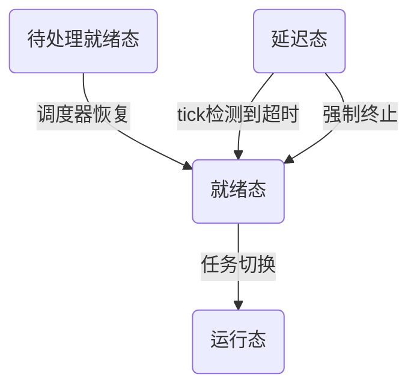
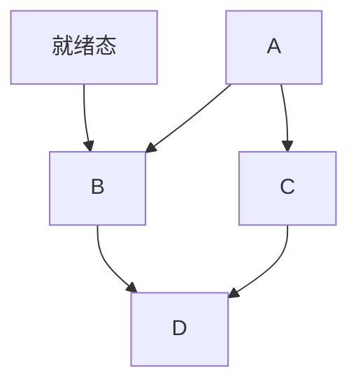

# 全局变量
## 状态
### pxCurrentTCB 或 pxCurrentTCBs
### pxReadyTasksLists
### xDelayedTaskList1
#### 定义
#### 作用
用于管理 延迟任务（Delayed Tasks） 的关键数据结构。它存储所有因调用 vTaskDelay() 或 vTaskDelayUntil() 而暂时挂起的任务，并在适当的时间重新激活它们；
### xDelayedTaskList2
### pxDelayedTaskList
### pxOverflowDelayedTaskList

### xPendingReadyList
#### 定义
#### 作用
全局链表，用于在任务调度器挂起期间临时存储被中断接触阻塞的任务，确保任务状态变更的安全性；
待调度器恢复时，从```xPendingReadyList```转移到就绪列表；

### 状态转换图

## xTasksWaitingTermination
## uxDeletedTasksWaitingCleanUp
## xSuspendedTaskList
## uxCurrentNumberOfTasks
## xTickCount
## uxTopReadyPriority
## xSchedulerRunning
## xPendedTicks
## xYieldPendings
## xNumOfOverflows
## uxTaskNumber
## xNextTaskUnblockTime
## xIdleTaskHandles
## uxTopUsedPriority
## uxSchedulerSuspended

## ulTaskSwitchedInTime
### 定义
### 功能

## ulTotalRunTime
### 定义
### 功能
用于统计系统的总运行时间。

# prvYieldForTask
## 参数
## 功能
负责在特定条件下触发任务切换，确保高优先级任务及时获得 CPU 控制权。与标准 taskYIELD() 不同，它包含智能的优先级决策机制，是抢占式调度的关键实现。
## 实现
步骤 1：

步骤 2.1：抢占最低优先级等于任务优先级 - 1；

步骤 2.2：对core0 ~ coreN：

步骤 2.2.1：获取当前核上正在运行的任务的优先级，

步骤 2.2.2：如果当前核上正在运行的任务的任务是IDLE:当前任务优先级-1；

步骤 2.2.3：如果当前核上正在运行的任务处于运行态并且当前核不需要延迟切换：

步骤 2.2.3.1：如果配置不支持运行多优先级

步骤 2.2.3.1.1：如果当前任务优先级 <= 强占最低优先

# prvCreateStaticTask
## 参数
## 功能
## 实现

# xTaskCreateStatic
## 参数
## 功能
## 实现

# xTaskCreateStaticAffinitySet
## 参数
## 功能
## 实现

# prvCreateRestrictedStaticTask
## 参数
## 功能
## 实现

# xTaskCreateRestrictedStatic
## 参数
## 功能
## 实现

# xTaskCreateRestrictedStaticAffinitySet
## 参数
## 功能
## 实现

# prvCreateRestrictedTask
## 参数
## 功能
## 实现

# xTaskCreateRestricted
## 参数
## 功能
## 实现

# xTaskCreateRestrictedAffinitySet
## 参数
## 功能
## 实现

# prvCreateTask
## 参数
## 功能
## 实现

# xTaskCreate
## 参数
## 实现
步骤 1：如果栈向下增长：

步骤 1.1：为任务TCB分配空间，并初始化空间为0；

步骤 1.2：为任务分配栈空间，

步骤 2：否则：

步骤 2.1：为任务分配栈空间；

步骤 2.2：为任务TCB分配空间，并初始化空间为0；

步骤 3：初始化TCB；

步骤 3.1：启用内存保护单元（MPU）：

步骤 3.1.1：任务优先级为特权模式下优先级；

步骤 3.1.2：重新计算任务优先级；

步骤 3.2：需要初始化栈为已知值：

步骤 3.2.1：初始化栈空间为已知值；

步骤 3.3：如果栈向下增长：

步骤 3.3.1：栈顶为栈高地址；

步骤 3.3.2：如果需要记录栈高地址，则保存栈高地址；

步骤 3.4：否则：

步骤 3.4.1：

步骤 3.4：如果任务名不为空：

步骤 3.5：保存任务优先级到 TCB：

步骤 3.6：如果开启互斥锁：

步骤 3.6.1 保存优先级值到任务base优先级字段；

步骤 3.7：初始化TCB列表；

步骤 3.8：如果启动内存保护单元：

步骤 3.8.1：初始化TCB mpu设置;

步骤 3.9：如果 TLS

步骤 3.9.1：

步骤 3.10：如果开启内存保护单元：

步骤 3.10.1：如果开启栈溢出检查：

步骤 3.10.1.1：如果栈向下增长：

步骤 3.10.1.1.1：

步骤 3.11：未开启内存保护单元：

# xTaskCreateAffinitySet
## 参数
## 功能
## 实现

# prvInitialiseNewTask
## 参数
## 功能
## 实现

# prvAddNewTaskToReadyList-单核
## 参数
## 功能
## 实现
步骤 1：进入临界区：

步骤 1.1：当前任务计数（```uxCurrentNumberOfTasks```）加一；

步骤 1.2：如果当前任务为空：

步骤 1.2.1：当前任务等于新添加的任务；

步骤 1.3：否则（当前任务不为空）：

步骤 1.3.1：如果任务调度器挂起中：

步骤 1.3.1.1：如果当前任务优先级小于等于新加到就绪列表任务的优先级：

步骤 1.3.1.1.1：当前任务等于新添加就绪任务；

步骤 1.4：任务计数（```uxTaskNumber```）自增；

步骤 1.5：如果启用“跟踪调试功能”：把任务计数赋值给任务TCB；

步骤 1.6：调用```prvAddTaskToReadyList```添加任务到就绪列表；

步骤 1.7：调用```portSETUP_TCB```对创建的任务的TCB进行硬件相关的初始化；

步骤 2：退出临界区；

步骤 3：如果任务调度器未挂起：

步骤 3.1：调用```taskYIELD_ANY_CORE_IF_USING_PREEMPTION```发起任务强占；


# prvAddNewTaskToReadyList-多核

# vTaskDelete
## 参数
## 功能
## 实现
步骤 1：调用```taskENTER_CRITICAL```进入临界区；

步骤 2：获取当前任务TCB；

步骤 3：从状态链移除该任务，没有移除：

步骤 3.1：重置任务优先级；

步骤 4：否则：

步骤 5：该任务在事件等待链表：

步骤 5.1：从事件等待链表删除；

步骤 6：否则：

步骤 7：任务数++；

步骤 8：调度器运行中并且任务运行中：

步骤 8.1：把任务插入到待终结列表；

步骤 8.2：待清理任务数+1；

步骤 8.3：

步骤 8.4：任务删除回调

步骤 8.5：配置多核：

步骤 8.5.1：当前任务正在运行：

步骤 8.5.1.1：当前任务运行核等于当前和：

步骤 9：否则：

步骤 9.1：任务数-1;

步骤 9.2：调用```prvResetNextTaskUnblockTime```接口

步骤 10：调用接口```taskEXIT_CRITICAL```退出临界区；

步骤 11：直接删除任务：释放任务TCB;

步骤 12：单核 && 调度器运行中：

步骤 12.1：待删除任务等于当前任务，触发任务调用

# xTaskDelayUntil
## 参数
## 功能
## 实现

# vTaskDelay
## 参数
## 功能
## 实现
步骤 1：延迟Tick 大于 0：

步骤 1.1：调用```vTaskSuspendAll```挂起调度器；

步骤 1.2：调用```prvAddCurrentTaskToDelayedList```将当前运行的任务添加到延迟列表;

步骤 1.3：调用```xTaskResumeAll```结束调度器挂起状态，并处理在挂起期间可能积累的待处理任务切换请求;

步骤 2：如果没有发生过调度器切换：

步骤 2.1：调用```taskYIELD_WITHIN_API```触发任务切换；

# eTaskGetState
## 参数
## 功能
## 实现

# uxTaskPriorityGet
## 参数
## 功能
## 实现

# uxTaskPriorityGetFromISR
## 参数
## 功能
## 实现

# uxTaskBasePriorityGet
## 参数
## 功能
## 实现

# uxTaskBasePriorityGetFromISR
## 参数
## 功能
## 实现

# vTaskPrioritySet
## 参数
## 功能
## 实现

# vTaskCoreAffinitySet
## 参数
## 功能
动态设置一个任务的处理器亲和性（CPU Affinity）。它控制任务可以在哪些处理器核心上运行。
+ 指定允许的核心集： 将任务限制为只能在xCoreAffinityMask参数指定的一个或多个特定 CPU 核心上执行。
+ 动态修改： 可以在任务运行期间的任何时候调用此函数（包括从其他任务或中断服务例程中调用，但需注意同步问题），以改变任务的亲和性。
+ 精细控制： 提供对任务执行位置的细粒度控制。
## 实现
步骤 1：进入临界区；

步骤 2：根据任务句柄获取任务 TCB；

步骤 3：设置任务 TCB 的核亲和度掩码；

步骤 4：任务调度器运行中：

步骤 4.1：任务运行中：

步骤 4.1.1：获取任务运行的CoreID；

步骤 4.1.2：如果运行的CoreID不在亲和度掩码，则调用```prvYieldCore```切换任务；

步骤 4.2：任务未运行：

步骤 4.2.1：如果开启任务强占式：

步骤 4.2.1.1：获取任务之前不允许运行的核;

步骤 4.2.1.2：如果任务不允许运行的核出现在当前亲和度掩码：调用```prvYieldForTask```接口，

步骤 5：退出临界区；

# vTaskCoreAffinityGet
## 参数
## 功能
## 实现

# vTaskPreemptionDisable
## 参数
## 功能
## 实现

# vTaskPreemptionEnable
## 参数
## 功能
## 实现

# vTaskSuspend
## 参数
## 功能
## 实现

# prvTaskIsTaskSuspended
## 参数
## 功能
## 实现

# vTaskResume
## 参数
## 功能
## 实现

# xTaskResumeFromISR
## 参数
## 功能
## 实现

# prvCreateIdleTasks
## 参数
## 功能
创建空闲任务
## 实现
步骤 1：
步骤 2：对core0 ~ coreN,

# vTaskStartScheduler
## 参数
## 功能
启动RTOS任务调度
## 实现
步骤 1：

步骤 2：调用接口```prvCreateIdleTasks```创建空闲任务;

步骤 3：如果启动软件定时器，调用接口 ```xTimerCreateTimerTask```创建定时器任务；

步骤 4：任务创建时执行额外的自定义初始化操作；

步骤 5：关闭中断；

步骤 6：调用接口 ```xPortStartScheduler```启用任务调度器；

# vTaskEndScheduler
## 参数
## 功能
## 实现

# vTaskSuspendAll
## 参数
## 功能
用于临时挂起任务调度器，防止任务切换发生；
+ 挂起调度器：暂停 RTOS 的调度逻辑，当前任务继续运行，但不会切换到其他任务。
+ 保护临界区：防止多任务并发冲突（如共享资源访问），比关中断更轻量（中断仍可响应）。
适用于较长临界区（如文件操作、复杂计算），替代关中断（taskENTER_CRITICAL()）以减少中断延迟。vTaskSuspendAll() 不能在中断服务程序内调用。
## 实现
步骤 1：配置为单核：

步骤 1.1：

步骤 1.2：调度器挂起计数++；

步骤 1.3：

步骤 2：配置为多核：

步骤 2.1：校验是否在ISR；

步骤 2.2：调度器运行中：

步骤 2.2.1：校验当前临界区的嵌套层级计数==0；

步骤 2.2.2：调用```portSET_INTERRUPT_MASK```禁用中断，并获取中断状态；

步骤 2.2.3：调用```portSOFTWARE_BARRIER```内存屏障

步骤 2.2.4：获取任务锁；

步骤 2.2.5：任务挂起计数为0：

步骤 2.2.5.1：调用```prvCheckForRunStateChange```

步骤 2.2.6：获取ISR锁；

步骤 2.2.7：任务调度器挂起计数++；

步骤 2.2.8：释放ISR中断锁；

步骤 2.2.9：恢复中断；

# prvGetExpectedIdleTime
## 参数
## 功能
## 实现

# xTaskResumeAll
## 参数
## 功能
恢复被挂起的调度器，重新允许任务切换；
## 实现
步骤 1： 如果配置单核或者（多核并且任务调度器运行中）：

步骤 1.1：进入临界区：

步骤 1.1.1：获取当前核ID；

步骤 1.1.2：任务挂起调度计数-1；

步骤 1.1.3：释放任务锁；

步骤 1.1.4：如果任务挂起调度计数等于0：

步骤 1.1.4.1：如果当前任务数大于0：

步骤 1.1.4.2：如果待处理就绪列表任务不为空：

步骤 1.1.4.2.1：取出链表第一个任务TCB;

步骤 1.1.4.2.2：从事件链表移除元素；

步骤 1.1.4.2.3：开启内存屏障；

步骤 1.1.4.2.4：从状态链表移除任务；

步骤 1.1.4.2.5：添加任务到就绪链表；

步骤 1.1.4.2.6：如果单核 并且 任务优先级大于当前任务优先级：当前核延迟切换为True；

步骤 1.1.4.3：如果任务TCB不为空：调用接口```prvResetNextTaskUnblockTime```


# xTaskGetTickCount
## 参数
## 功能
## 实现

# xTaskGetTickCountFromISR
## 参数
## 功能
## 实现

# uxTaskGetNumberOfTasks
## 参数
## 功能
## 实现

# pcTaskGetName
## 参数
## 功能
## 实现

# prvSearchForNameWithinSingleList - 单核
## 参数
## 功能
## 实现

# prvSearchForNameWithinSingleList - 多核
## 参数
## 功能
## 实现

# xTaskGetHandle
## 参数
## 功能
## 实现

# xTaskGetStaticBuffers
## 参数
## 功能
## 实现

# uxTaskGetSystemState
## 参数
## 功能
## 实现

# xTaskGetIdleTaskHandle
## 參數
## 功能
## 实现

# xTaskGetIdleTaskHandleForCore
## 参数
## 功能
## 实现

# vTaskStepTick
## 参数
## 功能
手动步进系统 Tick 函数
## 实现

# xTaskCatchUpTicks
## 参数
## 功能
是 FreeRTOS 中用于 手动补偿丢失的系统 Tick 的内部函数，主要应用于需要精确控制时间推进的场景（如时间模拟、测试或低功耗模式恢复）。
在系统从低功耗模式（无 Tick 中断）唤醒后，补偿休眠期间未处理的 Tick。
## 实现

# xTaskAbortDelay
## 参数
## 功能
用于强制终止任务的阻塞状态
## 实现
步骤 1：调用```vTaskSuspendAll```挂起调度器；

步骤 1.1：任务状态为阻塞态：

步骤 1.1.1：从状态链表移除任务；

步骤 1.1.2：进入临界区：

步骤 1.1.2.1：如果任务事件链表不为空：

步骤 1.1.2.1.1：从事件链表移除；

步骤 1.1.2.1.2:

步骤 1.1.3：退出临界区；

步骤 1.1.4：将任务加入就绪链表；

步骤 1.1.5：如果开启抢占式：

步骤 1.1.5.1：单核，任务优先级大于当前任务优先级，核0需要切换；

步骤 1.1.5.2：多核：

步骤 1.1.5.2.1：进入临界区：

步骤 1.1.5.2.1.1: 调用```prvYieldForTask```

步骤 1.1.5.2.2：退出临界区；

步骤 2：调用```xTaskResumeAll```恢复调度器；

# xTaskIncrementTick
## 参数
## 功能
在每次系统 Tick 中断中被调用，负责管理时间相关的任务状态变更；
## 实现
步骤 1：如果调度器挂起计数等于0：

步骤 1.1：如果当前Tick 大于下一个任务解阻塞：

步骤 1.1.1: 如果延迟任务列表为空：设置变量```xNextTaskUnblockTime```为最大值；

步骤 1.1.2：否则:

步骤 1.1.2.1：从延迟列表取出任务TCB；

步骤 1.1.2.2：获取任务超时时间；

步骤 1.1.2.3：如果当前Tick小于任务超时时间，设置下一个任务解阻塞时间为超时时间；

步骤 1.1.2.4：从状态链移除任务；

步骤 1.1.2.5：如果事件列表：从事件列表移除任务；

步骤 1.1.2.6：调用```prvAddTaskToReadyList```添加任务到就绪列表；

步骤 1.1.2.7：如果开启强占式：

步骤 1.1.2.7.1：如果单核：如果任务优先级大于当前任务优先级，需要切换任务；

步骤 1.1.2.7.2：多核：调用```prvYieldForTask```切换；

步骤 1.2：如果开启抢占式并且开启时间分片：

步骤 1.2.1：单核：如果当前优先级下就绪链表长度大于1，需要切换任务；

步骤 1.2.2：多核：遍历所有核。如果核下面当前任务同优先级就绪链表长度大于1，当前core需要强制切换；

步骤 1.3：如果开启抢占式：

步骤 1.3.1：单核：如果核0为延迟切换，则设置需要切换任务；

步骤 1.3.2：多核：


# vTaskSetApplicationTaskTag
## 参数
## 功能
## 实现

# xTaskGetApplicationTaskTag
## 参数
## 功能
## 实现

# xTaskGetApplicationTaskTagFromISR
## 参数
## 功能
## 实现

# xTaskCallApplicationTaskHook
## 参数
## 功能
## 实现

# vTaskSwitchContext - 单核
## 参数
## 功能
任务调度时，选择下一个要运行的任务；
## 实现
步骤 1：任务调度器挂起：

步骤 2：任务调度器未挂起：

步骤 2.1：如果启用运行时任务统计功能：

步骤 2.1.1：

步骤 2.2：检查栈溢出

步骤 2.3：高效选择最高优先级就绪任务；

步骤 2.3.1：从当前就绪任务选最高优先级开始遍历继续队列；

步骤 2.3.2：设置当前任务控制块；

# vTaskSwitchContext-多核
## 参数
## 功能
## 实现
步骤 1：获取任务锁；

步骤 2：获取ISR锁；

步骤 3：任务调度器挂起：

步骤 4：任务调度器未挂起：

步骤 4.1：如果启用运行时任务统计功能：

步骤 4.2：检查栈溢出；

步骤 4.3：调用```prvSelectHighestPriorityTask```接口选择最高优先级任务

步骤 5：释放ISR锁；

步骤 6：释放任务锁；

# vTaskPlaceOnEventList
## 参数
## 功能
## 实现

# vTaskPlaceOnUnorderedEventList

# vTaskPlaceOnEventListRestricted

# xTaskRemoveFromEventList

# vTaskRemoveFromUnorderedEventList

# vTaskSetTimeOutState

# vTaskInternalSetTimeOutState

# xTaskCheckForTimeOut

# vTaskMissedYield

# uxTaskGetTaskNumber

# vTaskSetTaskNumber

# prvPassiveIdleTask

# prvIdleTask
## 参数
## 功能
## 实现
步骤 1：

步骤 2：如果配置多核：调用```taskYIELD``（通过ecall触发软中断）触发任务切换；

步骤 3：循环：

步骤 3.1：调用接口```prvCheckTasksWaitingTermination```清理已经终止的任务（通过调用vTaskDelete删除的任务）；

步骤 3.2：如果配置非任务强占式：触发软中断，

步骤 3.3：如果配置为任务强占式并且配置空闲任务主动让出CPU给同优先级任务：

步骤 3.3.1：如果当前同Idle任务同优先级就绪列表长度大于核数，触发软中断

# eTaskConfirmSleepModeStatus

# vTaskSetThreadLocalStoragePointer

# pvTaskGetThreadLocalStoragePointer

# vTaskAllocateMPURegions

# prvInitialiseTaskLists

# prvCheckTasksWaitingTermination
## 参数
## 功能
当一个任务被删除时，如果该任务是由内核动态分配（即使用xTaskCreate创建），那么它的TCB（任务控制块）和栈需要被释放。由于删除任务的操作可能发生在中断上下文或其他任务中，
直接释放内存可能不安全（特别是在实时系统中），因此FreeRTOS采用了一种延迟清理机制：将需要清理的任务的TCB添加到一个终止任务列表中，然后由空闲任务（Idle Task）在安全的上下文中实际执行清理工作。
## 实现
步骤 1：待清理删除任务数 > 0 :

步骤 1.1：配置为单核：

步骤 1.1.1：调用```taskENTER_CRITICAL```进入临界区；

步骤 1.1.2：从待终结任务列表，取出任务 TCB；

步骤 1.1.3：从状态列表移除；

步骤 1.1.4：当前任务数-1；

步骤 1.1.5：当前待清理任务数-1；

步骤 1.1.6：调用```taskEXIT_CRITICAL```退出临界区；

步骤 1.1.7：调用```prvDeleteTCB```释放TCB;

步骤 1.2：配置多核：

步骤 1.2.1：```taskENTER_CRITICAL```

步骤 1.2.2：待清理任务数 > 0:

步骤 1.2.2.1：从待终结任务列表获取第一个TCB;

步骤 1.2.2.2：待终结任务运行状态为非运行态：

步骤 1.2.2.2.1：从状态列表移除；

步骤 1.2.2.2.2: 当前任务数-1；

步骤 1.2.2.2.3：当前待清理任务数-1；

步骤 1.2.3：否则：

步骤 1.2.3.1：调用```taskEXIT_CRITICAL```接口，退出临界区

步骤 1.2.3.2：beak;

步骤 1.


# vTaskGetInfo

# prvListTasksWithinSingleList

# prvTaskCheckFreeStackSpace

# uxTaskGetStackHighWaterMark2

# uxTaskGetStackHighWaterMark

# prvDeleteTCB

# prvResetNextTaskUnblockTime

# xTaskGetCurrentTaskHandle - 单核

# xTaskGetCurrentTaskHandle - 多核

# xTaskGetCurrentTaskHandleForCore

# xTaskGetSchedulerState

# xTaskPriorityInherit

# xTaskPriorityDisinherit

# vTaskPriorityDisinheritAfterTimeout

# vTaskYieldWithinAPI
## 参数
## 功能
## 实现


# vTaskEnterCritical - 单核
## 参数
## 功能
## 实现
步骤 1：调用```portDISABLE_INTERRUPTS```去使能中断；

步骤 2：任务调度器运行中：

步骤 2.1：当前任务临界区嵌套深度++；

步骤 2.2：如果当前任务临界区嵌套深度等于1：assert不在ISR；

# vTaskEnterCritical - 多核
## 参数
## 功能
## 实现
步骤 1：调用```portDISABLE_INTERRUPTS```去使能中断；

步骤 2：任务调度器运行中：

步骤 2.1：调用```portGET_CRITICAL_NESTING_COUNT``获取临界区嵌套深度，如果深度等于0：

步骤 2.1.1：获取任务锁；

步骤 2.1.2：获取中断锁；

步骤 2.2：调用```portINCREMENT_CRITICAL_NESTING_COUNT```接口增加临界区中断嵌套计数；

步骤 2.3：调用```portGET_CRITICAL_NESTING_COUNT``获取临界区嵌套深度，如果深度等于1：

步骤 2.3.1：如果调度器没有挂起：调用接口```prvCheckForRunStateChange```

# vTaskEnterCriticalFromISR
## 参数
## 功能
## 实现
步骤 1：任务调度器运行中：

步骤 1.1：调用```portSET_INTERRUPT_MASK_FROM_ISR```禁止中断；

步骤 1.2：如果当前嵌套深度等于0：调用```portGET_ISR_LOCK```获取中断锁；

步骤 1.3：调用```portINCREMENT_CRITICAL_NESTING_COUNT```增加临界区嵌套计数；

# vTaskExitCritical - 单核
## 参数
## 功能
## 实现
步骤 1：任务调度器运行中：

步骤 1.1：当前任务TCB 临界区嵌套深度大于0：

步骤 1.1.1：当前任务TCB 临界区嵌套深度等于0：调用```portENABLE_INTERRUPTS```使能中断；

# vTaskExitCritical - 多核
## 参数
## 功能
## 实现
步骤 1：任务调度器运行中：

步骤 1.1：当前嵌套深度大于0：

步骤 1.1.1：调用```portDECREMENT_CRITICAL_NESTING_COUNT```接口递减嵌套深度

步骤 1.1.2：如果当前嵌套深度等于0：

步骤 1.1.2.1：调用```portRELEASE_ISR_LOCK```释放中断锁；

步骤 1.1.2.2：调用```portRELEASE_TASK_LOCK```释放任务锁；

步骤 1.1.2.3：调用```portENABLE_INTERRUPTS```使能中断；

步骤 1.1.2.4：如果当前核不需要延迟调度：调用```portYIELD```让出CPU控制权；


# vTaskExitCriticalFromISR
## 参数
## 功能
## 实现
步骤 1：任务调度器运行中：

步骤 1.1：如嵌套深度大于0：

步骤 1.1.1：调用```portDECREMENT_CRITICAL_NESTING_COUNT```接口递减嵌套深度；

步骤 1.1.1.1：如果当前嵌套深度大于0：调用接口```portCLEAR_INTERRUPT_MASK_FROM_ISR```

# prvWriteNameToBuffer

# vTaskListTasks
## 参数
## 功能
## 实现

# uxTaskResetEventItemValue

# pvTaskIncrementMutexHeldCount
## 参数
## 功能
主要用于支持优先级继承机制（Priority Inheritance），解决互斥锁（Mutex）场景下的优先级反转问题；

1. 核心作用
（1）更新互斥锁持有计数
+ 当任务成功获取一个互斥锁（Mutex） 时调用此函数
+ 递增当前任务控制块（TCB）中的 uxMutexesHeld 计数器，记录该任务当前持有的互斥锁数量；
（2）返回当前任务句柄

2. 解决优先级翻转
（1）低优先级（L）持有互斥锁
（2）中优先级（M）强占CPU；
（3）高优先级任务（H）申请同一互斥锁被阻塞；
解决方案：

## 实现
步骤 1：获取当前任务；

步骤 2：

# xPortStartScheduler

## 参数
## 功能
## 实现
步骤 1：

步骤 2：调用```vPortSetupTimerInterrupt```接口，用于配置硬件定时器以产生固定频率的中断，这些中断将驱动操作系统的任务调度；

步骤 3：如果定义了mtime寄存器地址和mtimecmp寄存器地址，使能机器模式下的定时器中断和外部中断；

步骤 4：调用```xPortStartFirstTask```接口，启动第一个任务；

## 解释
### 为什么需要显示启动第一个任务？
+ 调度器启动前，系统处于"无任务运行"状态；
+ 没有任务上下文，CPU 不知道从哪里开始执；
+ 需手动加载首个任务的上下文（栈指针/寄存器/入口点）；
+
### mtime和mtimecmp
RISC-V 规范定义了 `mtime` 和 `mtimecmp` 寄存器，用于产生定时中断（如系统节拍中断）。

mtime：`mtime` 是一个 64 位只读寄存器，提供当前计时器的计数值；

mtimecmp`：是一个 64 位读写寄存器，用于设置下一次定时中断的触发时间；

# xPortStartFirstTask
## 参数
## 功能
通过模拟中断返回机制，将 CPU 上下文切换到第一个任务。
## 实现
步骤 1：加载当前任务控制块指针；

步骤 2：恢复任务上下文（模拟中断返回）；

步骤 3：恢复关键系统寄存器；

步骤 4：调整栈指针（调过已恢复的上下文）；

步骤 5：强制返回用户模式并跳转到任务；
## 解释

# prvSelectHighestPriorityTask
## 参数
## 功能
## 实现
步骤 1：如果配置核亲和度为1，

步骤 2：配置未开启运行多优先级

步骤 3：如果当前任务的当前任务同优先级就绪队列包含当前任务

步骤 3.1：

步骤 3.2：

步骤 4：

步骤 4.1：当前优先级就绪队列不为空：

步骤 4.1.1：遍历当前优先级就绪队里：

步骤 4.1.1.1：当前就绪任务处于非运行态：

步骤 4.1.1.1.1：如果核亲和度值不为1或则当前就绪任务

步骤 4.1.1.1.1.1：设置当前运行任务的运行状态为非运行态；

步骤 4.1.1.1.1.2：如果核亲和度配置为1：

步骤 4.1.1.1.1.3：当前就绪任务的运行状态设置为CoreID；

当前 4.1.1.1.1.4：当前运行指针指向当前就绪任务；

步骤 4.1.1.2：当前就绪任务等于当前运行任务：

步骤 4.1.1.2.1：如果核亲和度不为1或者当前就绪任务核亲和度掩码

步骤 4.1.1.3：否则：

# prvCheckForRunStateChange
## 参数
## 功能
负责检测任务状态变化并触发必要的调度操作， 
## 实现
步骤 1：获取核当前运行任何 TCB；

步骤 2：如果核当前任务处于主动让出CPU控制权态：

步骤 2.1：获取当前临界嵌套深度；

步骤 2.1.1：当前临界嵌套深度大于0：

步骤 2.1.1.1：设置临界嵌套深度为0；

步骤 2.1.1.1：释放中断锁；

步骤 2.1.2：释放任务锁；

步骤 2.1.3：开启内存屏障；

步骤 2.1.4：

步骤 2.1.5：重新启用中断；

步骤 2.1.6：

步骤 2.1.7：去使能中断

步骤 2.1.8：获取任务锁；

步骤 2.1.9：获取中断锁；

# prvAddCurrentTaskToDelayedList
## 参数
## 功能
负责将当前运行的任务移入阻塞态并加入延迟列表。
## 实现
步骤 1：

步骤 2：从就绪列表中移除任务；

步骤 3：包含任务挂起：

步骤 3.1：如果延迟Tick等于最大延迟并且：添加当前任务到挂起任务列表；

步骤 3.2：否则：

步骤 3.2.1：设置当前任务Tick；

步骤 3.2.2：如果总Tick 小于 ：添加当前任务到溢出延迟列表；

步骤 3.2.3：否则：

步骤 3.2.3.1：添加当前任务到延迟任务列表；

步骤 4：不包含任务挂起：

步骤 4.1：计算任务被唤醒的时间点：当前系统节拍计数+超时时间；

步骤 4.2：设置当前任务唤醒时间；

步骤 4.3：如果唤醒时间溢出，则将当前任务加入到溢出延迟任务列表；

步骤 4.4：未溢出：

步骤 4.4.1：将当前任务加入到延迟任务列表；

步骤 4.4.2：如果当前唤醒时间点小于下一个任务解阻塞时间，设置写一个任务解阻塞时间点位当前唤醒时间点；

# 性能监控关键函数
## ulTaskGetIdleRunTimePercent
### 参数
### 功能
用于计算系统空闲任务（Idle Task）的运行时间百分比。这个百分比直接反映了系统的 CPU 利用率 和 负载状况。
### 实现
## ulTaskGetIdleRunTimeCounter
### 参数
### 功能
### 实现
## ulTaskGetRunTimeCounter
### 参数
### 功能
### 实现
## ulTaskGetRunTimePercent

## vTaskGetRunTimeStatistics
### 参数
### 功能
用于获取系统中所有任务的 CPU 占用率、运行时间等关键性能数据；
### 实现


# 任务通知机制
## 原理
### 核心概念
FreeRTOS 的任务通知机制是一种轻量级、高效的任务间通信（IPC）和同步机制；
核心概念：
+ 每个任务自带一个“通知值”：
+ 通知作为事件或数据载体：其他任务或中断服务程序（ISR）可以通过向目标任务发送“通知”来：（ulNotifiedValue）
  + 通知一个事件发生
  + 传递一个数值；
  + 更新目标任务通知值的特定位；
+ 任务等待通知：目前任务可以使用API阻塞自身，等待通知的到来（可指定超时时间）；
+ 高效性： 由于通知直接操作任务 TCB 内的变量，省去了操作独立内核对象（队列、信号量等）的开销，速度极快（通常比使用队列快 45%），且节省内存（不需要额外分配内核对象内存）。

### 通知值的操作方式（发送通知时指定）
当向一个任务发送通知 (xTaskNotify, xTaskNotifyGive, xTaskNotifyAndQuery, xTaskNotifyAndQueryFromISR 等) 时，发送者可以指定如何更新目标任务的 ulNotifiedValue；
+ eNoAction： 不更新通知值。仅用于“轻触”任务（解除其阻塞状态）。相当于一个二值信号量。
+ eSetBits： 将通知值中的指定位置 1（按位或）。类似于事件组。
+ eIncrement： 将通知值加 1。相当于一个计数信号量。
+ eSetValueWithOverwrite： 无条件地覆盖目标任务的通知值（无论任务之前是否在等待）。
+ eSetValueWithoutOverwrite： 仅在目标任务的通知值未被消费（即自上次被读取后未被更新过）时才覆盖它。如果通知值已被消费（处于“pending”状态），则发送失败。用于避免丢失数据。
### 接收/等待通知
目标任务使用```ulTaskNotifyTake``` 或```xTaskNotifyWait```来等待通知；
+ ulTaskNotifyTake：
  + 主要用于计数信号量场景；
  + 阻塞任务（可选超时），直到收到通知；
  + 在退出前，将通知值递减指定的数量（通常为1，用于模拟获取信号量）或清零（用于模拟获取二值信号量）
  + 返回值是调用之前的通知值（对于计数信号量）或是否收到了通知（对于二值信号量）；
+ xTaskNotifyWait
  + 功能更强大、更通用。
  + 阻塞任务（可选超时），直到收到通知；
  + 在等待前，可以指定一个位掩码 ulBitsToClearOnEntry 来清除通知值的某些位；
  + 在收到通知退出前，可以指定另一个位掩码 ulBitsToClearOnExit 来清除通知值的某些位；
  + 可以获取收到通知时的完整通知值（通过 pulNotificationValue 参数返回）；
  + 返回 pdTRUE 表示等到通知，pdFALSE 表示超时
### 状态与“Pengding”
+ 任务的通知状态（是否在等待通知）由 TCB 中的一个状态标志管理；
+ 当通知发送给一个正在等待通知的任务时，该任务会被解除阻塞，其通知值会根据发送时的参数更新，并且其通知状态标志被清除；
+ 当通知发送给一个没有在等待通知的任务时：
  + 通知值会根据发送参数更新；
  + 任务的通知状态标志会被设置为 “pending”（待处理）；
  + 下次该任务调用 ulTaskNotifyTake 或 xTaskNotifyWait 时：
    + 如果使用 ulTaskNotifyTake，它会立即返回（因为状态是 pending），并根据参数递减或清零通知值；
    + 如果使用 xTaskNotifyWait，它也会立即返回（因为状态是 pending），返回当前的通知值（或按位掩码操作后的值）；
### 优点
+ 极快： 操作直接作用于 TCB，速度远超队列、信号量等；
+ 内存高效： 不需要创建额外的内核对象（队列、信号量、事件组），节省 RAM；
+ 灵活： 可以模拟二值信号量、计数信号量、事件组、单元素队列等多种 IPC 原语；
+ 状态保持： 即使任务未在等待，通知值（和 pending 状态）也会被保存，不会丢失事件（这与信号量不同，信号量如果没有任务等待，事件就会丢失）。中断发送通知非常可靠；
### 限制/注意事项
+ 单接收者： 一个任务通知只能发送给一个特定的目标任务。它不能广播给多个任务（事件组可以），也不能被多个任务同时等待获取（队列/信号量可以）。它是严格的一对一通信。
+ 不能替代所有 IPC： 虽然灵活，但对于需要传递大数据块（需要队列）、需要广播给多个任务（需要事件组）、需要多个任务等待同一个资源（需要信号量/队列）的场景，任务通知不是直接替代品。
+ 通知值含义由应用定义： 通知值的具体含义（是简单的信号、计数、位标志还是具体数据）需要应用程序自己定义和管理；
## xTaskGenericNotifyWait
### 参数
### 功能
### 实现
步骤 1：挂起所有任务：

步骤 1.1：进入临界区：

步骤 1.1.1：如果当前任务通知状态不等于已接收态：

步骤 1.1.1.1：清除通知值；

步骤 1.1.1.2：设置通知状态为等待通知态；

步骤 1.1.1.3：如果超时时间不为0：设置需要阻塞为Ture;

步骤 1.2：退出临界区；

步骤 1.3：需要阻塞：调用```prvAddCurrentTaskToDelayedList```接口添加当前任务到延迟任务列表；

步骤 2：调用接口```xTaskResumeAll```恢复任务；

步骤 3：如果需要阻塞并且恢复任务没有发生任务切换，调用```taskYIELD_WITHIN_API```;

步骤 4：进入临界区：

步骤 4.1：如果通知值不为空：设置参数通知值等于当前任务通知值；

步骤 4.2：如果当前任务通知状态不等于已接收态：设置返回False;

步骤 4.3：否则：设置通知值等于清除位，设置返回True;

步骤 4.4：设置当前任务通知状态为等待通知态；

步骤 5：退出临界区；

## ulTaskNotifyTake-ulTaskGenericNotifyTake
### 参数
### 作用
### 实现
步骤 1：挂起调度器；

步骤 1.1：进入临界区：

步骤 1.1.1：如果当前任务通知值等于0：

步骤 1.1.1.1：设置当前任务通知状态为等待通知状态；

步骤 1.1.1.2：如果超时时间大于0：设置需要阻塞标记为True;

步骤 1.2：退出临界区；

步骤 1.3：如果需要阻塞标记为True：添加当前任务到延迟任务列表；

步骤 2：恢复调度器；

步骤 3：如果需要阻塞并且恢复调度器没有发生任务切换：调用```taskYIELD_WITHIN_API```接口触发任务切换；

步骤 4：进入临界区：

步骤 4.1：获取当前任务通知值；

步骤 4.2：当前任务通知值不为0：

步骤 4.2.1：如果退出清除策略是归零计数器：设置通知值为0；

步骤 4.2.2：设置当前任务通知值为当前值-1；

步骤 4.3：设置当前任务通知状态为等待通知态；

步骤 5：退出临界区；

## ulTaskGenericNotifyValueClear
### 参数
### 功能
是 FreeRTOS 任务通知机制 的核心函数之一，用于原子性地清除任务通知值而不改变通知状态。这是 FreeRTOS 轻量级任务间通信的关键操作。
### 实现

## ulTaskGenericNotifyTake
### 参数
+ uxIndexToWait	UBaseType_t：通知索引
+ xClearCountOnExit	BaseType_t：退出时清除策略：pdTRUE-归零计数器，pdFALSE-递减计数器
+ xTicksToWait	TickType_t：最大等待事件
### 功能
 是 FreeRTOS 任务通知机制 的核心函数，用于实现轻量级的任务同步与事件等待；
### 实现
步骤 1：任务挂起；

步骤 2：进入临界区；

步骤 2.1：如果当前任务对应通知值为0：

步骤 2.1.1：设置当前任务的通知状态为等待通知；

步骤 2.1.2：如果超时时间大于0：需要阻塞；

步骤 3：退出临界区；

步骤 4：如果需要阻塞：调用```prvAddCurrentTaskToDelayedList```接口，添加当前任务到延迟任务列表；

步骤 5：恢复所有任务；

步骤 6：如果需要阻塞并且任务切换：

步骤 7：进入临界区：

步骤 7.1：

## xTaskNotify-xTaskGenericNotify
### 参数
+ TaskHandle_t xTaskToNotify：任务句柄
+ UBaseType_t uxIndexToNotify：通知索引
+ uint32_t ulValue：通知携带的值
+ eNotifyAction eAction：通知操作类型
  + 0：仅更新状态，不修改值；
  + 1：按位设置
  + 2：计数值加1
  + 3：强制覆盖通知值
  + 4：仅当未通知时设置
+ uint32_t * pulPreviousNotificationValue：返回先前的通知值；
### 功能
### 实现
步骤 1：根据任务句柄获取任务 TCB；

步骤 2：进入临界区：

步骤 2.1：如果传入存储先前通知值的指针不为空，保存任务通知值；

步骤 2.2：保存任务当前通知状态；

步骤 2.3：设置任务当前通知状态为已接收通知状态；

步骤 2.4：操作类型为按位设置：任务当前通知值为 |= 传入的通知值；

步骤 2.5：操作类型为计数值加1：任务当前通知值++；

步骤 2.6：操作类型为强制覆盖值：任务当前通知值等于参数传入的通知值；

步骤 2.7：如果任务之前通知状态不是已接收态：设置任务通知值为通知携带的值；

步骤 2.8：如果任务之前状态为等待通知态：

步骤 2.8.1：从状态链下链；

步骤 2.8.2：调用接口```prvAddTaskToReadyList```添加到就绪链；

步骤 2.8.3：使用最小空闲Tick数不等于0：调用接口```prvResetNextTaskUnblockTime```接口，

步骤 2.8.4：调用接口```taskYIELD_ANY_CORE_IF_USING_PREEMPTION``

步骤 3：退出临界区；


## xTaskGenericNotifyFromISR

## vTaskGenericNotifyGiveFromISR
### 参数
+ TaskHandle_t xTaskToNotify：
+ UBaseType_t uxIndexToNotify：
+ BaseType_t * pxHigherPriorityTaskWoken：
### 功能
### 实现
步骤 1：ISR 进入临界区；

步骤 1.1：保存任务当前通知态；

步骤 1.2：设置任务通知态为已接收态；

步骤 1.3：任务通知值++；

步骤 1.4：如果任务之前通知状态为等待通知态：

步骤 1.4.1：如果任务调度器未被挂起：

步骤 1.4.1.1：从状态链表移除；

步骤 1.4.1.2：调用接口```prvAddTaskToReadyList```添加任务到就绪链表；

步骤 1.4.2：如果任务调度器被挂起：添加任务事件链表到Pending就绪链表；

步骤 1.4.3：如果配置为单核：

步骤 1.4.3.1：如果任务优先级大于当前任务优先级：

步骤 1.4.3.1.1：pxHigherPriorityTaskWoken设置为TRUE；

步骤 1.4.3.1.2：延迟切换为True;

步骤 1.4.4：如果配置为多核：

步骤 1.4.4.1：如果配置强占模式：

步骤 1.4.4.1.1：调用```prvYieldForTask```强制切换任务；

步骤 1.4.4.1.1：如果当前核延迟切换，设置pxHigherPriorityTaskWoken设置为TRUE；

步骤 2：ISR 退出临界区；


## xTaskGenericNotifyStateClear
## 参数
+ TaskHandle_t xTask：任务句柄
+ UBaseType_t uxIndexToClear：通知索引
## 功能
用于原子性地清除任务的通知状态而不修改通知值
## 实现
步骤 1：根据任务句柄获取任务 TCB;

步骤 2：进入临界区：

步骤 2.1：如果任务当前通知状态为**已接收通知态**

步骤 2.1.1：设置任务当前通知状态为等待通知态，返回 Pass；

步骤 2.2：返回 Fail;

步骤 3：退出临界区；


