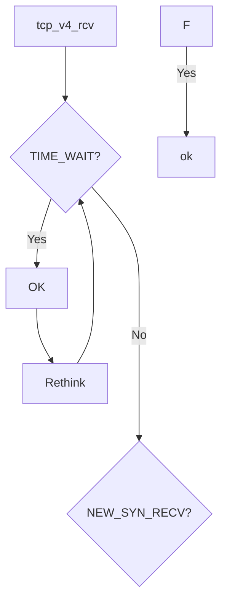
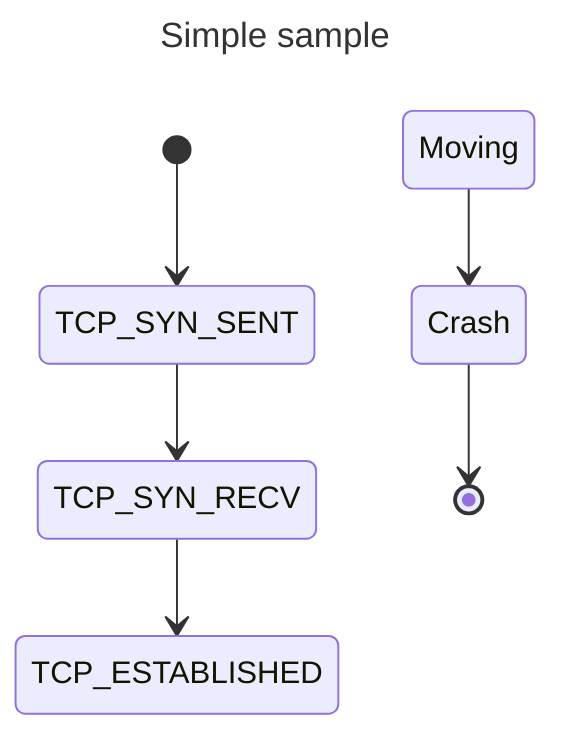

常见定义：
```C
struct tcp_options_received {
    int ts_recent_stamp;    
    u32 ts_recent;
    u32	rcv_tsval;
    u32	rcv_tsecr;
    u16 saw_tstamp : 1,     // 标记是否在SYN包中看到时间戳选项
        tstamp_ok : 1,      // 是否最终启用时间戳功能（双方都支持）
        dsack : 1,          // 是否支持重复SACK（RFC-2883）
        wscale_ok : 1,      // 是否启用窗口缩放（RFC-1323）
        sack_ok : 3,        // 是否启用选择性确认（RFC-2018）
        smc_ok : 1,         // 
        snd_wscale : 4,     // 发送窗口缩放因子（实际窗口大小 = 通告窗口 << snd_wscale）
        rcv_wscale : 4;     // 接收窗口缩放因子
    u8	saw_unknown:1,
       unused:7;
    u8	num_sacks;
    u16	user_mss;           // 用户设置的MSS
    u16	mss_clamp;          // 协商的MSS上限
};
```

```C
struct tcp_sock {
    __be32 pred_flags;
    u32 rcv_nxt;
    u32 rcv_wup;
    u32 snd_nxt;
    u32 snd_una;
    u32 lost;
};
```
+ pred_flags
  用于缓存某些频繁检查的 TCP 状态标志，使得内核在快速路径（Fast Path）处理时能 避免重复计算，提高性能。
+ rcv_nxt
  下一个期望接收的序列号；
+ rcv_wup
  表示最后一次发送窗口更新（Window Update）时的接收序列号。主要功能：
  + 延迟窗口更新：避免频繁发送窗口更新（ACK + Window Update）;
  + 与 rcv_nxt 配合，确保窗口更新仅在接收数据后触发；
  + 防止窗口死锁：在特定场景下（如零窗口探测）恢复通信；
+ snd_nxt
  表示下一个要发送的序列号；
+ snd_una
  表示发送方最早未被确认的序列号;
+ lost
  表示已标记为丢失但尚未重传的数据包数量。



  
 0                   1                   2                   3
 
 0 1 2 3 4 5 6 7 8 9 0 1 2 3 4 5 6 7 8 9 0 1 2 3 4 5 6 7 8 9 0 1
 
+-+-+-+-+-+-+-+-+-+-+-+-+-+-+-+-+-+-+-+-+-+-+-+-+-+-+-+-+-+-+-+-+

|          Source Port          |       Destination Port        |

+-+-+-+-+-+-+-+-+-+-+-+-+-+-+-+-+-+-+-+-+-+-+-+-+-+-+-+-+-+-+-+-+

|                        Sequence Number                        |

+-+-+-+-+-+-+-+-+-+-+-+-+-+-+-+-+-+-+-+-+-+-+-+-+-+-+-+-+-+-+-+-+

|                    Acknowledgment Number                      |

+-+-+-+-+-+-+-+-+-+-+-+-+-+-+-+-+-+-+-+-+-+-+-+-+-+-+-+-+-+-+-+-+

|  Data |           |U|A|P|R|S|F|                               |

| Offset| Reserved  |R|C|S|S|Y|I|            Window             |

|       |           |G|K|H|T|N|N|                               |

+-+-+-+-+-+-+-+-+-+-+-+-+-+-+-+-+-+-+-+-+-+-+-+-+-+-+-+-+-+-+-+-+

|           Checksum            |         Urgent Pointer        |

+-+-+-+-+-+-+-+-+-+-+-+-+-+-+-+-+-+-+-+-+-+-+-+-+-+-+-+-+-+-+-+-+

|                    Options (if Data Offset > 5)               |

|                             ...                               |

+-+-+-+-+-+-+-+-+-+-+-+-+-+-+-+-+-+-+-+-+-+-+-+-+-+-+-+-+-+-+-+-+

|                             Data                              |

+-+-+-+-+-+-+-+-+-+-+-+-+-+-+-+-+-+-+-+-+-+-+-+-+-+-+-+-+-+-+-+-+


## tcp_timewait_state_process
步骤 1：如果TCP头数据偏移大于TCP头部长度并且时间戳有效：

步骤 1.1 调用```tcp_parse_options``解析数据包中的可选字段；

步骤 1.2 如果可选字段包含时间戳：

步骤 2：如果子状态为```TCP_FIN_WAIT2```:

步骤 2.1：如果PAWS校验失败或者数据包不在

步骤 2.1.1：调用```tcp_timewait_check_oow_rate_limit```

步骤 2.2：如果TCP头复位标志位有效：

步骤 2.3：如果数据包TCP头SYN标志位有效并且序列号大于等于下一个期望收到的序列号：返回需要发送RST响应；

步骤 2.4：如果数据包TCP头ACK标志位无效或者结束序列包小于等于下一个期望收到的序列号或者结束序列包等于当前数据包序列号：

步骤 2.4.1：调用```inet_twsk_put```接口减少套接字引用计数，如果计数降为0，释放套接字资源，资源清理；

步骤 2.4.2：返回SUCCESS;

步骤 2.5：如果数据包TCP头FIN标志位未有效或者结束序列表号不等于下一个期望收到的序列号+1：返回需要发送RST响应；

步骤 2.6：设置子状态为```TIME_WAIT```;

步骤 2.7：调用```twsk_rcv_nxt_update```更新TIME_WAIT状态套接字接收序列号;

步骤 2.8：如果可选字段包含时间戳：

步骤 2.8.1：更新套接字最近时间戳；

步骤 2.8.2：更新套接字

步骤 2.9：调用```inet_twsk_reschedule```重新调度TIME_WAIT状态套接字定时器

步骤 2.10：返回需要发送ACK响应；

步骤 3：如果PAWS校验成功并且数据包序列号等于套接字下一个期望收到的序列号并且数据包序列号等于结束序列号或者数据包复位标志位有效：

步骤 3.1：如果数据包复位标志有效：

步骤 3.1.1：如果不需要遵循RFC1337规范：调用```inet_twsk_deschedule_put```取消定时器调度并释放套接字资源，最后返回SUCCESS；

步骤 3.2：或者：调用```inet_twsk_reschedule```延长TIME_WAIT时间并且动态调整超时；

步骤 3.3：如果可选字段包含时间戳：

步骤 3.3.1：更新套接字

步骤 3.4：调用```inet_twsk_put```释放TIME_WAIT状态套接字资源，并返回SUCESS;

步骤 4：如果数据包TCP头SYN标志位有效并且复位标志位无效并且ACK字段无效并且PAWS校验成功并且（数据包序列号大于套接字下一个期望收到的序列号或者）

步骤 5：如果PAWS校验失败：

步骤 6：如果接收数据包TCP头复位标志位无效：

步骤 6.1：如果PAWS校验失败或者接收数据包ACK有效：

步骤 6.2：调用```tcp_timewait_check_oow_rate_limit```接口

步骤 7：调用```inet_twsk_put```接口

步骤 8：返回SUCCESS，结束；


步骤 1：

## tcp_rcv_state_process
步骤 1：如果socket状态为```TCP_CLOSE```：


步骤 2：如果socket状态为```TCP_LISTEN```：

步骤 2.1：如果接收数据包TCP头ACK字段有效：返回1；

步骤 2.2：如果接收数据包TCP头RST标志位有效：

步骤 2.2.1：设置丢弃原因```TCP_RESET```;

步骤 2.2.2：跳转到步骤；

步骤 2.3：如果接收数据包TCP头SYN字段有效：

步骤 2.3.1：如果接收数据包TCP头FIN字段有效：设置丢包原因```TCP_FLAGS```，跳转到步骤

步骤 2.3.2：调用```dccp_v4_conn_request```接口，返回是否接收；

步骤 2.3.3：如果没有接收返回1；

步骤 2.3.4：调用```consume_skb```，返回0；

步骤 2.4：否则：设置丢包原因```TCP_FLAGS```，跳转到步骤


步骤 3：如果socket状态为```TCP_SYN_SENT```


步骤 ：调用```tcp_drop_reason```;

步骤 ：返回0，结束；


## tcp_v4_do_rcv
步骤 1：如果Socket状态为```TCP_ESTABLISHED```态；

步骤 1.1：调用```sock_rps_save_rxhash```保存接收哈希值以支持高效的负载均衡;

步骤 1.2：调用```sk_mark_napi_id```多队列网卡环境下优化数据包处理性能；

步骤 1.3：如果

步骤 1.4：调用```tcp_rcv_established```;

步骤 2：调用```tcp_checksum_complete```，校验失败：

步骤 3：如果socket状态为```TCP_LISTEN```：

步骤 3.1：调用```tcp_v4_cookie_check``` TCP SYN Cookie 验证；

步骤 3.2：如果返回sock为空：丢弃报文

步骤 3.3：如果返回sock不等于当前sock:

步骤 3.4.1：调用```tcp_child_process```

步骤 4：否则：调用```sock_rps_save_rxhash```

步骤 5：调用```tcp_rcv_state_process```


## tcp_v4_rcv
步骤 1：调用```inet_sdif```获取确定接收数据包的输入网络设备索引；

步骤 2：调用```__inet_lookup_skb```获取数据包对应的socket;


步骤 3：如果对应socket状态为TIME_WAIT状态：

步骤 3.1：调用```xfrm4_policy_check```校验IPV4数据包的IPsec策略，校验失败：

步骤 3.2：调用```tcp_v4_fill_cb```

步骤 3.3：调用```tcp_checksum_complete```校验数据包校验和，如果校验失败：

步骤 3.4：调用```tcp_timewait_state_process```并返回

步骤 3.5：如果返回SYN（收到有效的SYN包）：

步骤 3.6：否则如果返回ACK（需要发送ACK响应）：

步骤 3.7：否则如果返回为RST（需要发送RST响应）：


步骤 4：如果socket状态为NEW_SYN_RECV态：

步骤 4.1：如果调用```xfrm4_policy_check```校验IPV4数据包的IPsec策略，校验失败：设置丢弃原因；

步骤 4.2：调用```tcp_inbound_hash```接口

步骤 4.3：如果

## tcp_timewait_state_process
步骤 1：子状态为 TCP_FIN_WAIT2 态：

## 流程详解
tcp_v4_connect


