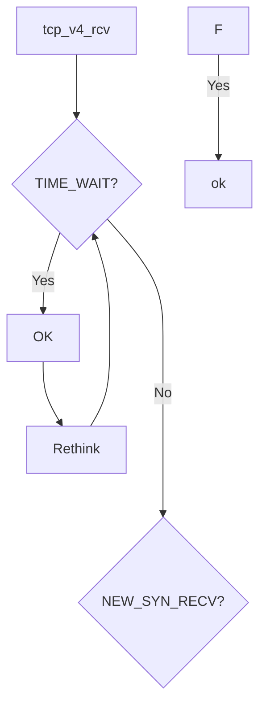
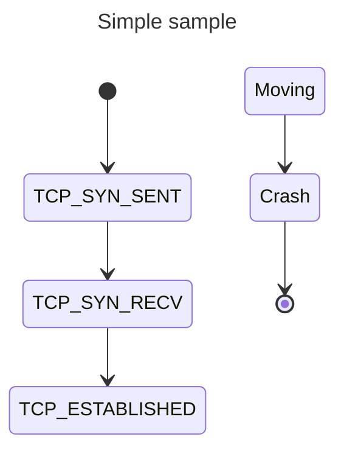

常见定义：
```C
struct tcp_options_received {
    int ts_recent_stamp;    
    u32 ts_recent;
    u32	rcv_tsval;
    u32	rcv_tsecr;
    u16 saw_tstamp : 1,     // 标记是否在SYN包中看到时间戳选项
        tstamp_ok : 1,      // 是否最终启用时间戳功能（双方都支持）
        dsack : 1,          // 是否支持重复SACK（RFC-2883）
        wscale_ok : 1,      // 是否启用窗口缩放（RFC-1323）
        sack_ok : 3,        // 是否启用选择性确认（RFC-2018）
        smc_ok : 1,         // 
        snd_wscale : 4,     // 发送窗口缩放因子（实际窗口大小 = 通告窗口 << snd_wscale）
        rcv_wscale : 4;     // 接收窗口缩放因子
    u8	saw_unknown:1,
       unused:7;
    u8	num_sacks;
    u16	user_mss;           // 用户设置的MSS
    u16	mss_clamp;          // 协商的MSS上限
};
```

```C
struct tcp_sock {
    __be32 pred_flags;
    u32 rcv_nxt;
    u32 rcv_wup;
    u32 snd_nxt;
    u32 snd_una;
    u32 lost;
};
```
+ pred_flags
  用于缓存某些频繁检查的 TCP 状态标志，使得内核在快速路径（Fast Path）处理时能 避免重复计算，提高性能。
+ rcv_nxt
  下一个期望接收的序列号；
+ rcv_wup
  表示最后一次发送窗口更新（Window Update）时的接收序列号。主要功能：
  + 延迟窗口更新：避免频繁发送窗口更新（ACK + Window Update）;
  + 与 rcv_nxt 配合，确保窗口更新仅在接收数据后触发；
  + 防止窗口死锁：在特定场景下（如零窗口探测）恢复通信；
+ snd_nxt
  表示下一个要发送的序列号；
+ snd_una
  表示发送方最早未被确认的序列号;
+ lost
  表示已标记为丢失但尚未重传的数据包数量。



  
 0                   1                   2                   3
 
 0 1 2 3 4 5 6 7 8 9 0 1 2 3 4 5 6 7 8 9 0 1 2 3 4 5 6 7 8 9 0 1
 
+-+-+-+-+-+-+-+-+-+-+-+-+-+-+-+-+-+-+-+-+-+-+-+-+-+-+-+-+-+-+-+-+

|          Source Port          |       Destination Port        |

+-+-+-+-+-+-+-+-+-+-+-+-+-+-+-+-+-+-+-+-+-+-+-+-+-+-+-+-+-+-+-+-+

|                        Sequence Number                        |

+-+-+-+-+-+-+-+-+-+-+-+-+-+-+-+-+-+-+-+-+-+-+-+-+-+-+-+-+-+-+-+-+

|                    Acknowledgment Number                      |

+-+-+-+-+-+-+-+-+-+-+-+-+-+-+-+-+-+-+-+-+-+-+-+-+-+-+-+-+-+-+-+-+

|  Data |           |U|A|P|R|S|F|                               |

| Offset| Reserved  |R|C|S|S|Y|I|            Window             |

|       |           |G|K|H|T|N|N|                               |

+-+-+-+-+-+-+-+-+-+-+-+-+-+-+-+-+-+-+-+-+-+-+-+-+-+-+-+-+-+-+-+-+

|           Checksum            |         Urgent Pointer        |

+-+-+-+-+-+-+-+-+-+-+-+-+-+-+-+-+-+-+-+-+-+-+-+-+-+-+-+-+-+-+-+-+

|                    Options (if Data Offset > 5)               |

|                             ...                               |

+-+-+-+-+-+-+-+-+-+-+-+-+-+-+-+-+-+-+-+-+-+-+-+-+-+-+-+-+-+-+-+-+

|                             Data                              |

+-+-+-+-+-+-+-+-+-+-+-+-+-+-+-+-+-+-+-+-+-+-+-+-+-+-+-+-+-+-+-+-+


## tcp_timewait_state_process
步骤 1：子状态为 TCP_FIN_WAIT2 态：

