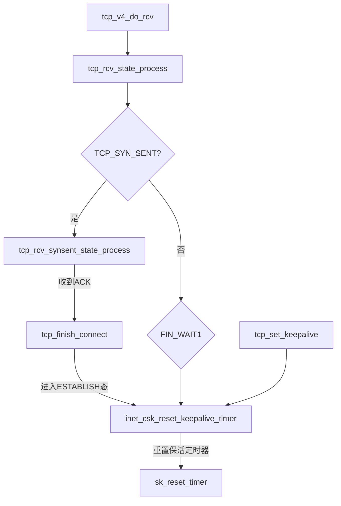
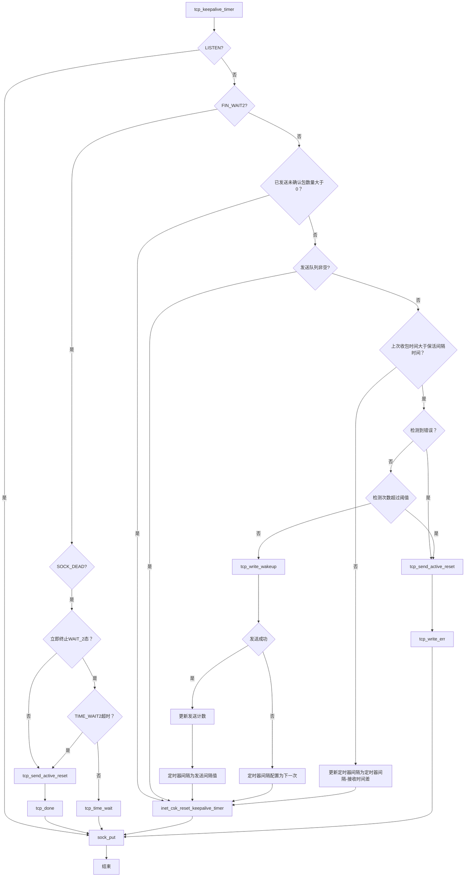

## 保活机制介绍

## LINUX 内核实现
### 重置保活定时器

```mermaid
graph TD
    A[tcp_v4_do_rcv]
    B[tcp_rcv_state_process]
    C{TCP_SYN_SENT?}
    D[tcp_rcv_synsent_state_process]
    E[tcp_finish_connect]
    F[inet_csk_reset_keepalive_timer]
    G[sk_reset_timer]
    H{FIN_WAIT1}
    I[tcp_set_keepalive]
    A --> B
    B --> C
    C -->|是| D
    D -->|收到ACK| E
    E -->|进入ESTABLISH态| F
    F -->|重置保活定时器| G
    C -->|否| H
    H --> F
    I --> F
```

### 保活定时器
当保活定时器超时调用 ```tcp_keepalive_timer```函数

```mermaid
graph TD
    A[tcp_keepalive_timer]
    B[sock_put]
    C[结束]
    D{LISTEN?}
    E{FIN_WAIT2?}
    F{SOCK_DEAD?}
    G{立即终止WAIT_2态？}
    H[tcp_send_active_reset]
    I{TIME_WAIT2超时？}
    J[tcp_done]
    K[tcp_time_wait]
    L{已发送未确认包数量大于0？}
    M[inet_csk_reset_keepalive_timer]
    N{发送队列非空?}
    O{上次收包时间大于保活间隔时间？}
    P{检测到错误？}
    Q[tcp_send_active_reset]
    R[tcp_write_err]
    S{检测次数超过阈值}
    T[tcp_write_wakeup]
    U{发送成功}
    V[更新发送计数]
    W[定时器间隔为发送间隔值]
    X[定时器间隔配置为下一次]
    Y[更新定时器间隔为定时器间隔-接收时间差]
    A --> D
    D -->|是| B
    B --> C
    D -->|否|E
    E -->|是|F
    F -->|是|G
    G -->|是|I
    G -->|否|H
    I -->|是| H
    H --> J
    J --> B
    I -->|否|K
    K --> B
    E -->|否|L
    L -->|是|M
    M --> B
    L -->|否|N
    N -->|是|M
    N -->|否|O
    O -->|是|P
    O -->|否|Y
    P -->|是|Q
    Q --> R
    R --> B
    P -->|否| S
    S -->|是| Q
    S -->|否|T
    T --> U
    U -->|是|V
    V --> W
    W --> M
    U -->|否|X
    X --> M
    Y --> M
```
