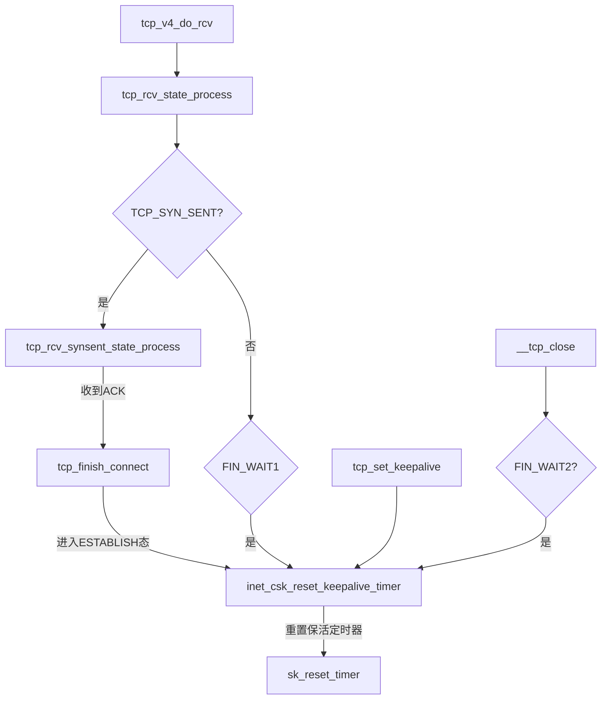
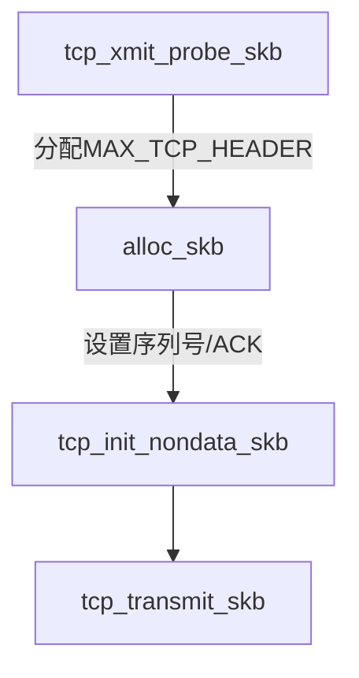

## 保活机制介绍

## LINUX 内核实现
### 重置保活定时器


### 保活定时器
当保活定时器超时调用 ```tcp_keepalive_timer```函数

### 保活报文

+ 报文不带数据；
+ 报文序列号为最后一个已确认数据序列号；
+ ACK序列号有效

### 相关配置
+ TCP_KEEPIDLE
  连接空闲多久后开始探测（默认7200s）
+ TCP_KEEPINTVL
  探测包发送间隔（默认75秒）
+ TCP_KEEPCNT
  最多发送几次探测包（默认9次）
