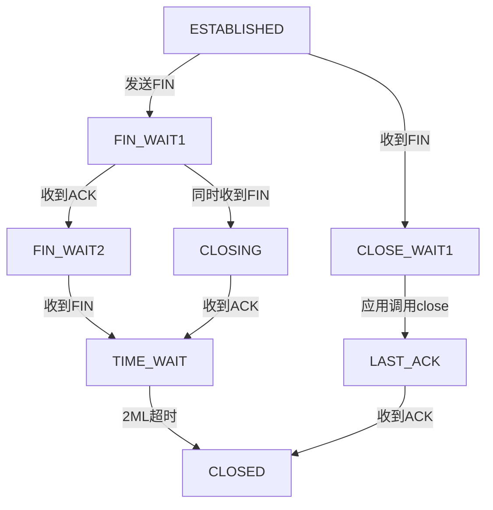

## 状态机

```mermaid
graph TD
    A[ESTABLISHED] -->|发送FIN| B[FIN_WAIT1]
    B -->|收到ACK| D[FIN_WAIT2]
    D -->|收到FIN| E[TIME_WAIT]
    E -->|2ML超时| F[CLOSED]
    B -->|同时收到FIN| H[CLOSING]
    H -->|收到ACK| E
    %% 
    A -->|收到FIN| C[CLOSE_WAIT1]
    C -->|应用调用close| G[LAST_ACK]
    G -->|收到ACK|F
```
