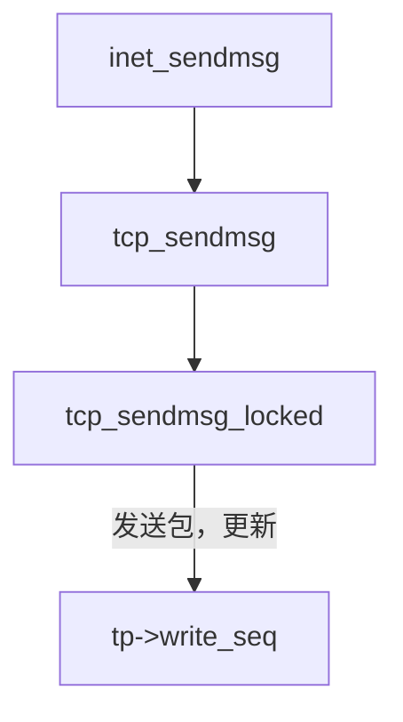

## 相关定义
```C
struct tcp_sock {
    ......
    u32 write_seq;
}
```
+ write_seq：应用层已写入TCP发送队列但尚未提交到网络层的最后一个序列号；

## 使用

```mermaid
graph TD
    A[inet_sendmsg]
    B[tcp_sendmsg]
    C[tcp_sendmsg_locked]
    D[tp->write_seq]
    A --> B
    B --> C
    C -->|发送包，更新| D
```
