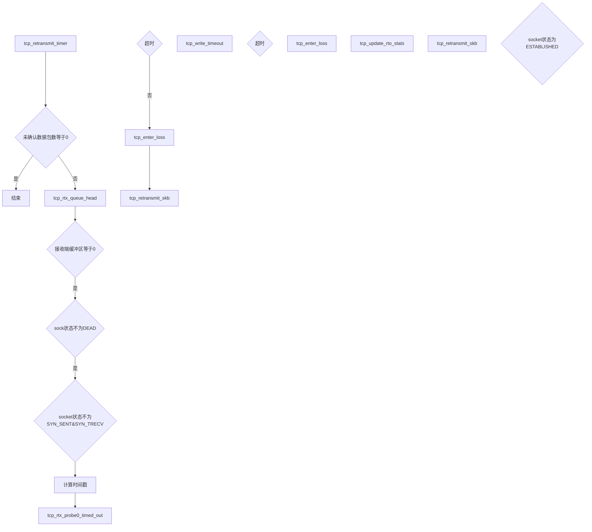

## LINUX内核实现
### 重传定时器

```mermaid
graph TD
    A[tcp_retransmit_timer]
    B[结束]
    C{未确认数据包数等于0}
    D[tcp_rtx_queue_head]
    A --> C
    C -->|是| B
    C -->|否| D

    E{接收端缓冲区等于0}
    F{sock状态不为DEAD}
    G{socket状态不为SYN_SENT&SYN_TRECV}
    H[计算时间戳]
    I[tcp_rtx_probe0_timed_out]
    J{超时}
    K[tcp_enter_loss]
    L[tcp_retransmit_skb]
    D --> E
    E -->|是| F
    F -->|是| G
    G --> H
    H --> I
    J -->|否| K
    K --> L

    N[tcp_write_timeout]
    O{超时}
    P[tcp_enter_loss]
    Q[tcp_update_rto_stats]
    R[tcp_retransmit_skb]

    M{socket状态为ESTABLISHED}

```
