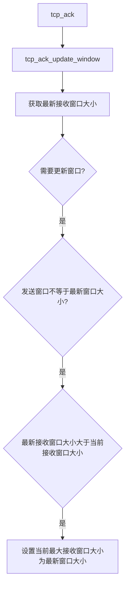

## sock_common
```c
struct sock_common {
    union {
    };
}
```
## sock
```c
struct sock {
    struct sock_common __sk_common;
    unsigned int sk_gso_max_size;
}
```
### sk_gso_max_size
GSO分片时单个子段的最大允许长度。

## inet_connection_sock

## tcp_sock
```C
struct tcp_sock {
    struct inet_connection_sock inet_conn;
    u16 tcp_header_len;
    u16 gso_segs;
    __be32	pred_flags;
    u64	bytes_received;
    u32	segs_in;
    u32	data_segs_in;
    u32	rcv_nxt;
    u32 max_window;
}
```
### tcp_header_len
定义了TCP头部的长度。
+ 三次连接过程中，如果在SYN_SENT状态收到服务端发动的报文中携带时间戳，那么TCP头部长度要加上时间戳长度。

### gso_segs
记录单个大尺寸数据包（SKB）通过 GSO 分片后生成的子段数量，从而在网卡硬件或驱动层高效处理分段，减轻 CPU 负载。

### pred_flags
预测标志位，用于优化TCP数据包处理路径的快速判断逻辑。

### bytes_received
sock连接接收报文字节数。

### segs_in

### data_segs_in

### rcv_nxt
接收端期望收到的下一个数据包的序列号（SEQ）。
+ 发送给对端，高速对端期望收到的下一个报文序列号、

### max_window
接收窗口历史最大值。



