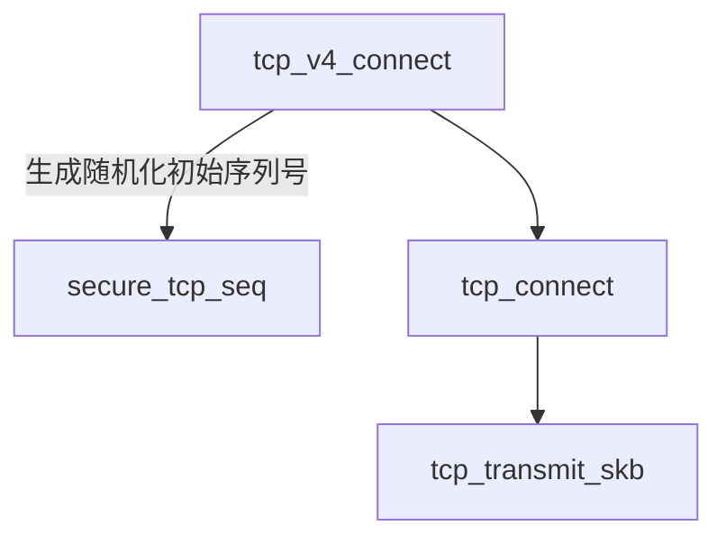
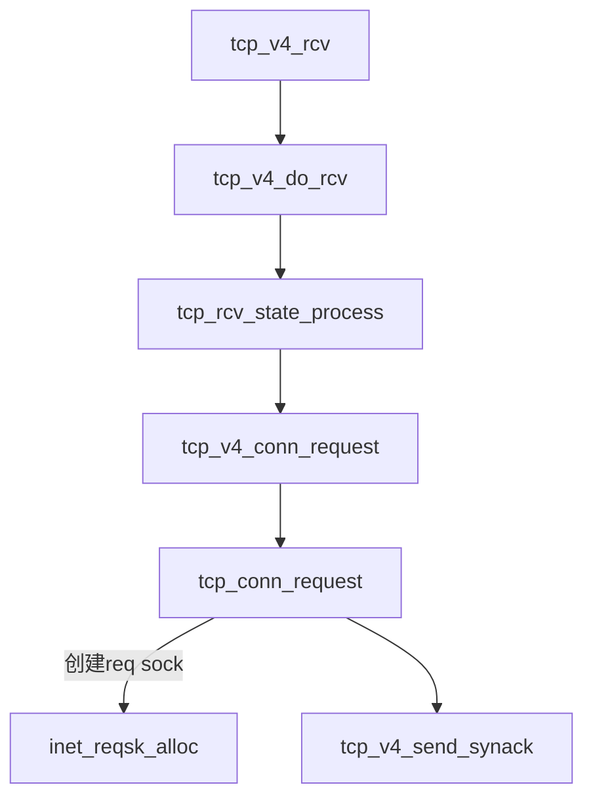
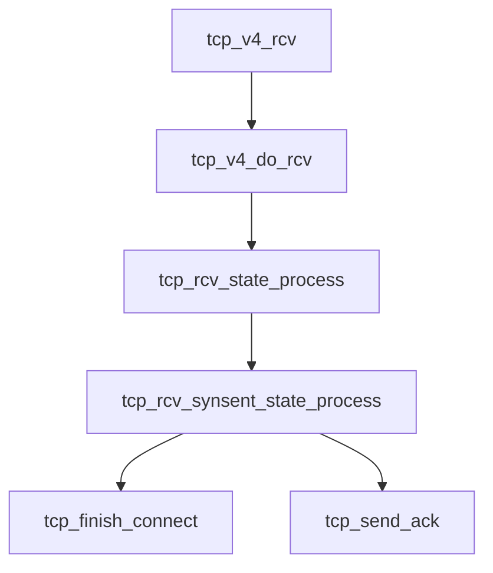
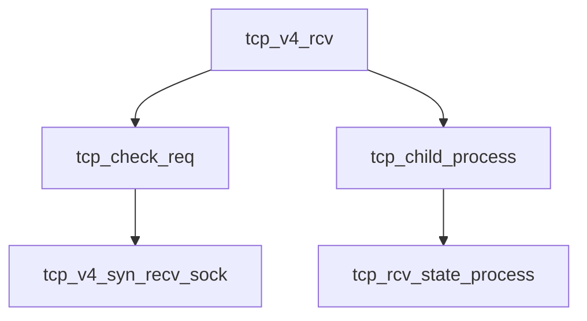

## Linux内核流程
### 客户端：进入SYN_SENT态

#### 随机化初始化序列号
使用加密哈希函数结合密钥、四元组（源/目的IP+端口）和动态因子（如时间戳）生成ISN。

### 服务端：从Listen态到TCP_NEW_SYN_RECV态

### 客户端：收到服务端发送的REQ/ACK报文进入TCP_ESTABLISHED态

### 服务端：收到ACK报文进入TCP_ESTABLISHED态

