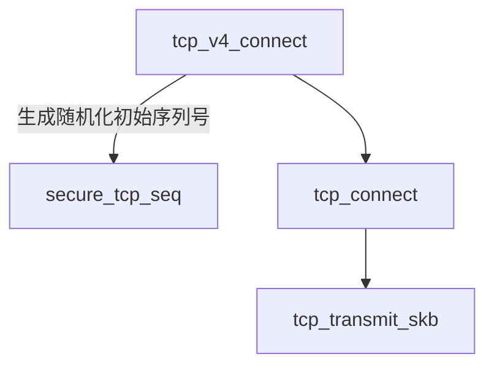

## Linux内核流程
### 客户端：进入SYN_SENT态

```mermaid
graph TD
    A[tcp_v4_connect] -->|生成随机化初始序列号| D[secure_tcp_seq]
    A --> E[tcp_connect]
    E --> C[tcp_transmit_skb]
```
#### 随机化初始化序列号
使用加密哈希函数结合密钥、四元组（源/目的IP+端口）和动态因子（如时间戳）生成ISN。
