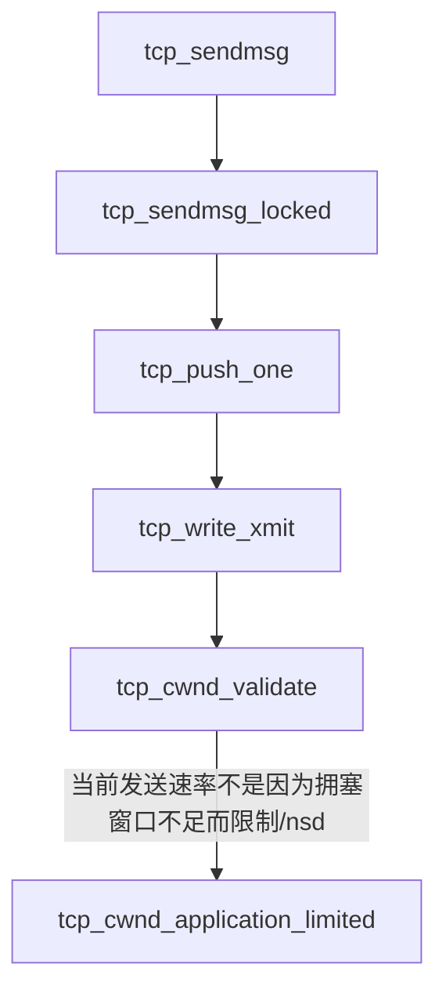
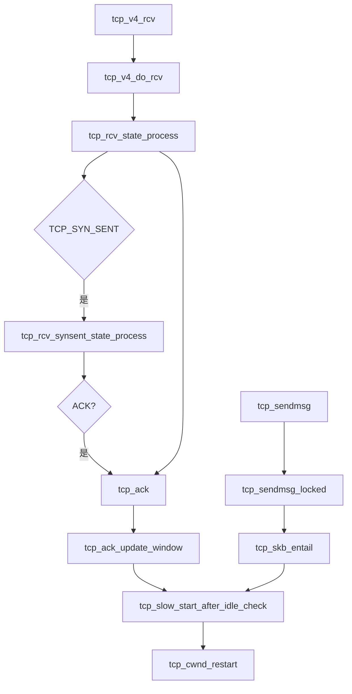

## 拥塞控制介绍
拥塞控制是网络通信中的核心机制，用于防止网络因过载而出现吞吐量下降、时延飙升甚至崩溃的现象。
其核心目标是在高吞吐与低时延之间寻求平衡，通过动态调整数据发送速率，确保网络资源的高效利用。

## 基础原理
### 拥塞成因与影响
（1）当网络资源（带宽、缓冲区、处理能力）需求超过供给时，出现拥塞，导致丢包率上升、时延增加，极端情况下引发“拥塞崩溃”（吞吐量趋近于零）。
（2）流量控制 vs 拥塞控制：前者解决接收端处理能力不足（端到端），后者解决网络中间节点瓶颈（全局性）
### 关键度量指标
（1）吞吐量与时延的权衡：网络效率公式为 E = 吞吐量/时延，最优操作点在“膝点”（Kleinrock's optimal point），越过“崖点”则效率暴跌。
（2）缓冲区管理：缓冲区过小易丢包，过大会引入排队时延（Bufferbloat问题）。

## 经典算法分类与演进
根据拥塞信号感知方式，主流算法可分为三类：

（1）基于丢包

代表算法：Reno、Cubic

核心机制：丢包视为拥塞，采用AIMD（加线性增/乘性减）调整窗口

（2）基于时延

代表算法：Vegas、FAST TCP

核心机制：监测RTT变化，时延增加则降速

（3）基于带宽时延积

代表算法：BBR

核心机制：动态测量瓶颈带宽（BtlBw）与传播时延（RTprop），维持inflight=BDP；

（4）显式反馈

代表算法：DCTCP、DCQCN	

核心机制：交换机通过ECN标记拥塞，端系统快速响应

### 算法演进关键点
+ 慢启动与拥塞避免
  初始指数增长窗口，到达阈值后线性增长，超时则重置；
+ 快速重传/恢复
  收到3个重复ACK立即重传丢失包，避免等待超时；
+ 公平性挑战
  BBR的ProbeRTT阶段可能抢占传统AIMD流带宽，需结合公平调度；

## Linux内核实现
### 应用层数据写入速率不足
传输受限于应用层而非网络时。核心目标是避免拥塞窗口因应用层数据供给不足而虚高，防止后续突发数据引发网络拥塞。

### 空闲连接拥塞窗口重置机制
TCP 连接长时间空闲后重新激活时，避免因拥塞窗口过大而引发网络拥塞，同时兼顾传输效率。
触发条件：
空闲时间超过阈值：连接最后一次发送时间（tp->lsndtime）与当前时间的差值大于当前RTO(icsk_rto)时触发。
系统配置启用：需满足 net.ipv4.tcp_slow_start_after_idle=1（默认值），且无正在传输的数据包（tp->packets_out == 0）

