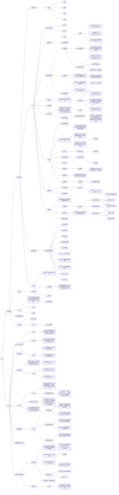

```mermaid
graph LR
    A(C++)

    %% 基础语法
    A --> B(基础语法)
    B --> B1

    B1(类和对象)
    B1 --> B11
    B11(面向对象)
    B11 --> B111
    B111(特性)
    B1111(抽象)
    B1112(封装)
    B1113(多态)
    B1114(继承)
    B111 --> B1111
    B111 --> B1112
    B111 --> B1113
    B111 --> B1114

B1 --> B12(类)
B12 --> B121(成员访问类型)
B121 --> B1211(public)
B121 --> B1212(private)
B121 --> B1213(public)

B12 --> B122(成员函数)
B122 --> B1221(const成员函数)

B12 --> B123(构造/析构函数)

B123 --> B1231(构造函数)
B1231 --> B12311(使用)
B12311 --> B123111("显示调用：Stock food = Stock(250, 1.25)")
B12311 --> B123112("隐式调用：Stock gatment(250, 1.25)")
B12311 --> B123113("不能使用对象来调用构造函数")
B1231 --> B12312(默认构造函数)
B12312 --> B123121(当且仅当没有定义任何构造函数时，编译器才会提供默认构造函数)
B123 --> B1232(析构函数)
B1232 --> B12321(对象生命周期结束时，自动调用，负责清理工作)
B123 --> B1233(复制构造函数)
B1233 --> B12331(用于将一个对象复制到新创建的对象中)
B1233 --> B12332("语法：ClassName(const ClassName &)")
B1233 --> B12333("调用场景")
B12333 --> B123331("ClassName obj(otherObj);")
B12333 --> B123332("ClassName obj = otherObj;")
B12333 --> B123333("ClassName obj = ClassName(otherObj);")
B12333 --> B123334("ClassName *obj = new ClassName(otherObj);")
B12333 --> B123335("注意：第2、3个场景可能使用复制构造函数生成一个临时对象，然后将临时对象的内容赋值给obj，取决于具体实现")
B1233 --> B12334("功能")
B12334 --> B123331("默认的复制构造函数逐个复制非静态成员，复制的是成员的值（浅复制）")
B1231 --> B12313("成员初始化列表")
B12313 --> B1231111("Queue::Queue(int qs) : qSize(qs), front(NULL), rear(NULL), item(0)")
B12313 --> B1231112("只能用于构造函数")
B12313 --> B1231113("初始化非静态const数据成员")
B12313 --> B1231114("数据成员被初始化的顺序与它们出现在类中的顺序相同")


B12 --> B125(this指针)
B125 --> B29(指向用来调用成员函数的对象)

B12 --> B124(对象数组)
B12 --> B2(类作用域)
B2 --> B3(在类中定义的命令的作用域都为整个类，作用域为整个类的名称只在该类中是已知的，在类外是不可知的)
B2 --> B4(静态成员变量)

B1 --> B5(操作符重载)
B5 --> B6(不能重载的操作符)
B6 --> B7(sizeof操作符)
B6 --> B8(".成员操作符")
B6 --> B9("*成员操作符")
B6 --> B10("::作用域解析操作符")
B6 --> B18("?:条件操作符")
B6 --> B17("typeid，一个RTTI操作符")
B6 --> B13("const_cast强制类型转换操作符")
B6 --> B14("dynamic_cast强制类型转换操作符")
B6 --> B15("reinterpret_cast")
B6 --> B16("static_cast")

B1 --> B19("友元")
B19 --> B20("提供另外一种形式的访问权限")
B19 --> B21("友元函数")
B19 --> B22("友元类")
B19 --> B23("友元成员函数")
B21 --> B24("让函数成员类的友元，可以赋予该函数与类的成员函数相同的访问权限")

B12 --> B25("继承")
    B25 --> B26("派生类构造函数")
B26 --> B27("基类对象首先被创建")
B26 --> B28("派生类构造函数应通过成员初始化列表将基类信息传递给基类构造函数")
B25 --> B30("派生类和基类之间的特殊关系")
B30 --> B31("基类指针可以在不进行显示类型转换的情况下指向派生类对象")
B30 --> B32("基类引用可以在不进行显示类型转换的情况下引用派生类对象")
B25 --> B33("is-a关系")
B33 --> B34("3种继承方式")
B34 --> B35("公有继承")
B34 --> B36("保护继承")
B34 --> B37("私有继承")
B25 --> B38("多态公有继承")
B38 --> B39("虚拟析构函数")
B25 --> B40("protected")
B25 --> B41("抽象基类")
B41 --> B42("纯虚函数")
B25 --> B43("私有继承")
B43 --> B44("基类的共有成员和保护成员都将称为派生类的私有成员")
    B25 --> B45("多重继承")
        B45 --> B46("虚基类")
            B46 --> B47("虚基类使得从多个类派生出的对象只继承一个基类对象")
            B46 --> B48("解决菱形继承问题")
            B46 --> B49("语法：class B : virtual public A { ... };")

B12 --> B50("类模板")
    B50 --> B51("定义类模板")
        B51 --> B52("template <class Type>")
    B50 --> B53("使用模板类")
B12 --> B54("嵌套类")
    B54 --> B55("通过提供新的类型类作用域来避免名称混乱")
    B54 --> B56("访问权限")
        B56 --> B57("作用域")
            B57 --> B58("申明在共有部分")
                B58 --> B59("包含它的类可以使用它")
                B58 --> B60("派生类可以使用")
                B58 --> B61("外部可以通过类限定符使用")
            B57 --> B62("申明在保护部分")
                B62 --> B59
                B62 --> B60
                B62 --> B63("外部不可使用")
            B57 --> B64("声明在私有部分")
                B64 --> B59
                B64 --> B65("派生类不可使用")
                B64 --> B63
        B54 --> B66("访问控制")
            B66 --> B67("对嵌套类访问权的控制规则与对常规类相同")
    B54 --> B68("模板中的嵌套")

B --> B69("异常")
    B69 --> B70("异常机制")
B --> B71("RTTI")
    B71 --> B72("RTTI 是运行阶段类型识别的简称，为程序在运行阶段确定对象的类型提供一种标准方式。")
    B71 --> B73("用途")
    B71 --> B74("原理")
B --> B75("类型转换操作符")
B --> B76("string类")
    B76 --> B77("构造字符串")
    B76 --> B78("STL")
        B78 --> B79("vector模板类")


    A --> D(C++ 11)
    D --> D1(auto & decltype)
    D1 --> D2(auto)
    D2 --> D3(auto 基于变量的初始化表达式推导类型，会忽略表达式的顶层const和引用)
    D1 --> D4(decltype)
    D4 --> D5(decltype 基于给定表达式的完整类型推导，保留顶层const和引用)
    D1 --> D6(差异)
    D6 --> D7("auto必须待初始化器（否则无法推导类型）")
    D6 --> D8("decltype无需初始化器，可直接声明变量")

D --> D9(范围for循环)
D --> D10(初始化列表)
D10 --> D11(提供了一种简洁、灵活的语法来初始化数组、容器、结构体等复杂数据结构)
D10 --> D12(语法)
D12 --> D13("初始化数组: int arr[] = {1, 2, 3, 4, 5};")
D12 --> D14("初始化容器：std::vector<int> vec = {1, 2, 3, 4, 5};")
D12 --> D15("初始化结构体：Point p = {10, 20};")

D --> D16(nullptr)
D16 --> D17(作用)
D17 --> D18(解决传统空指针表示NULL/0缺陷的重要特性，旨在提升类型安全性和代码表达清晰度)
D17 --> D19(解决重载歧义问题)
D19 --> D20("void func(int);    // 版本1 void func(void *);      // 版本2 func(NULL);// 调用版本1，而非预期的版本2")
D16 --> D21("类型系统的一致性")
D21 --> D22("C 语言的NULL是 (void*)0，但C++禁用void* 到其他指针类型的隐式转换，因此C++的NULL只能定义为0，丢失类型信息")
D16 --> D23("nullptr 是类型安全的空指针常量，隐式转换为任意指针类型，避免类型混淆")

D --> D24("强枚举类型")
D24 --> D25("作用")
D25 --> D26("作用域隔离")
D26 --> D27("传统枚举的成员暴露在外部作用域中，不能枚举的同名成员会冲突")
D26 --> D28("enum class 成员必须通过枚举名访问，作用域隔离")
D25 --> D29("禁止隐式整型转换")
D29 --> D30("传统枚举成员可隐式转换为整型，易引发逻辑错误")
D29 --> D31("enum class 禁止隐式转换，必须显示操作")
D25 --> D32("可指定底层类型")
D32 --> D33("传统枚举底层类型由编译器决定，可能导致跨平台问题")
D32 --> D34("enum class 允许显示指定类型 enum class Port : uint8_t { HTTP=80, HTTPS=44 };")

D --> D35("编译器常量constexpr")

D --> D36("右值引用和移动语义")
    D36 --> D37("右值引用")
        D37 --> D38("用于支持移动语义和完美转发，旨在提升程序性能并优化资源管理")
        D37 --> D39("左值：有持久标识符、可取地址")
        D37 --> D40("右值：临时对象，无标识符、不可取地址")
            D40 --> D41("纯右值")
            D40 --> D42("将亡值：被标记为可移动的对象（如 std::move（a））")
        D37 --> D43("右值引用 T&&")
            D43 --> D44("绑定右值，延长其生命周期")
            D43 --> D45("int && rr = 5;")
     D36 --> D46("移动语义")
         D46 --> D47("避免深拷贝，直接窃取资源")
         D46 --> D48("实现")
             D48 --> D49("移动构造函数：接管源对象的资源（如指针），并置空源对象")
```
