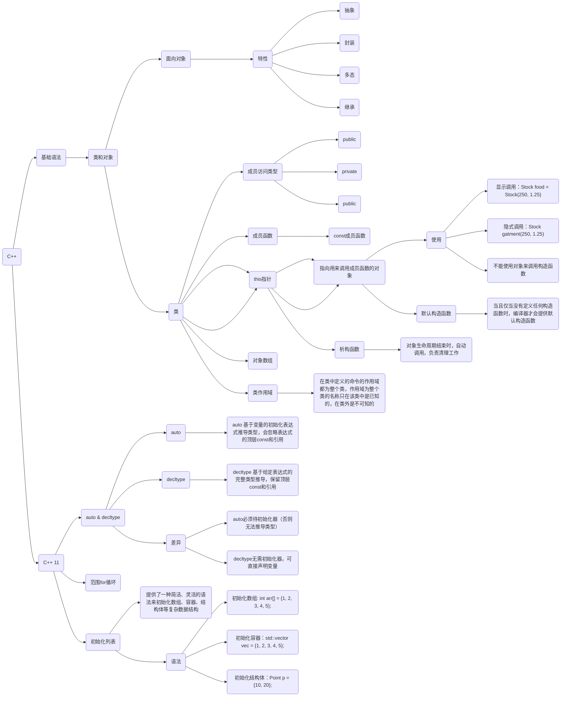

```mermaid
graph LR
    A(C++)

    %% 基础语法
    A --> B(基础语法)
    B --> B1

    B1(类和对象)
    B1 --> B11
    B11(面向对象)
    B11 --> B111
    B111(特性)
    B1111(抽象)
    B1112(封装)
    B1113(多态)
    B1114(继承)
    B111 --> B1111
    B111 --> B1112
    B111 --> B1113
    B111 --> B1114

B1 --> B12(类)
B12 --> B121(成员访问类型)
B121 --> B1211(public)
B121 --> B1212(private)
B121 --> B1213(public)

B12 --> B122(成员函数)
B122 --> B1221(const成员函数)

B12 --> B123(构造/析构函数)
B123 --> B1231(构造函数)
B1231 --> B12311(使用)
B12311 --> B123111("显示调用：Stock food = Stock(250, 1.25)")
B12311 --> B123112("隐式调用：Stock gatment(250, 1.25)")
B12311 --> B123113("不能使用对象来调用构造函数")
B1231 --> B12312(默认构造函数)
B12312 --> B123121(当且仅当没有定义任何构造函数时，编译器才会提供默认构造函数)
B123 --> B1232(析构函数)
B1232 --> B12321(对象生命周期结束时，自动调用，负责清理工作)

B12 --> B123(this指针)
B123 --> B1231(指向用来调用成员函数的对象)

B12 --> B124(对象数组)
B12 --> B2(类作用域)
B2 --> B3(在类中定义的命令的作用域都为整个类，作用域为整个类的名称只在该类中是已知的，在类外是不可知的)


    A --> D(C++ 11)
    D --> D1(auto & decltype)
    D1 --> D2(auto)
    D2 --> D3(auto 基于变量的初始化表达式推导类型，会忽略表达式的顶层const和引用)
    D1 --> D4(decltype)
    D4 --> D5(decltype 基于给定表达式的完整类型推导，保留顶层const和引用)
    D1 --> D6(差异)
    D6 --> D7("auto必须待初始化器（否则无法推导类型）")
    D6 --> D8("decltype无需初始化器，可直接声明变量")

D --> D9(范围for循环)
D --> D10(初始化列表)
D10 --> D11(提供了一种简洁、灵活的语法来初始化数组、容器、结构体等复杂数据结构)
D10 --> D12(语法)
D12 --> D13("初始化数组: int arr[] = {1, 2, 3, 4, 5};")
D12 --> D14("初始化容器：std::vector<int> vec = {1, 2, 3, 4, 5};")
D12 --> D15("初始化结构体：Point p = {10, 20};")
```
