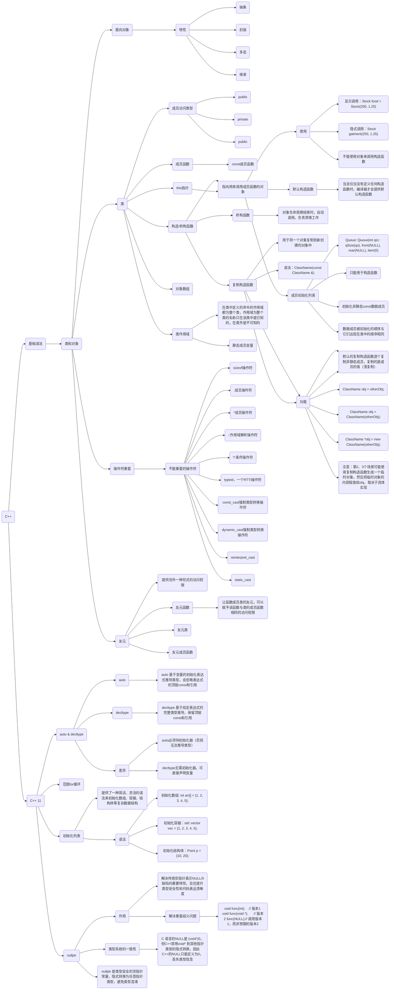

```mermaid
graph LR
    A(C++)

    %% 基础语法
    A --> B(基础语法)
    B --> B1

    B1(类和对象)
    B1 --> B11
    B11(面向对象)
    B11 --> B111
    B111(特性)
    B1111(抽象)
    B1112(封装)
    B1113(多态)
    B1114(继承)
    B111 --> B1111
    B111 --> B1112
    B111 --> B1113
    B111 --> B1114

B1 --> B12(类)
B12 --> B121(成员访问类型)
B121 --> B1211(public)
B121 --> B1212(private)
B121 --> B1213(public)

B12 --> B122(成员函数)
B122 --> B1221(const成员函数)

B12 --> B123(构造/析构函数)

B123 --> B1231(构造函数)
B1231 --> B12311(使用)
B12311 --> B123111("显示调用：Stock food = Stock(250, 1.25)")
B12311 --> B123112("隐式调用：Stock gatment(250, 1.25)")
B12311 --> B123113("不能使用对象来调用构造函数")
B1231 --> B12312(默认构造函数)
B12312 --> B123121(当且仅当没有定义任何构造函数时，编译器才会提供默认构造函数)
B123 --> B1232(析构函数)
B1232 --> B12321(对象生命周期结束时，自动调用，负责清理工作)
B123 --> B1233(复制构造函数)
B1233 --> B12331(用于将一个对象复制到新创建的对象中)
B1233 --> B12332("语法：ClassName(const ClassName &)")
B1233 --> B12333("调用场景")
B12333 --> B123331("ClassName obj(otherObj);")
B12333 --> B123332("ClassName obj = otherObj;")
B12333 --> B123333("ClassName obj = ClassName(otherObj);")
B12333 --> B123334("ClassName *obj = new ClassName(otherObj);")
B12333 --> B123335("注意：第2、3个场景可能使用复制构造函数生成一个临时对象，然后将临时对象的内容赋值给obj，取决于具体实现")
B1233 --> B12333("功能")
B12333 --> B123331("默认的复制构造函数逐个复制非静态成员，复制的是成员的值（浅复制）")
B1231 --> B12313("成员初始化列表")
B12313 --> B1231111("Queue::Queue(int qs) : qSize(qs), front(NULL), rear(NULL), item(0)")
B12313 --> B1231112("只能用于构造函数")
B12313 --> B1231113("初始化非静态const数据成员")
B12313 --> B1231114("数据成员被初始化的顺序与它们出现在类中的顺序相同")


B12 --> B125(this指针)
B125 --> B1231(指向用来调用成员函数的对象)

B12 --> B124(对象数组)
B12 --> B2(类作用域)
B2 --> B3(在类中定义的命令的作用域都为整个类，作用域为整个类的名称只在该类中是已知的，在类外是不可知的)
B2 --> B4(静态成员变量)

B1 --> B5(操作符重载)
B5 --> B6(不能重载的操作符)
B6 --> B7(sizeof操作符)
B6 --> B8(".成员操作符")
B6 --> B9("*成员操作符")
B6 --> B10("::作用域解析操作符")
B6 --> B18("?:条件操作符")
B6 --> B17("typeid，一个RTTI操作符")
B6 --> B13("const_cast强制类型转换操作符")
B6 --> B14("dynamic_cast强制类型转换操作符")
B6 --> B15("reinterpret_cast")
B6 --> B16("static_cast")

B1 --> B19("友元")
B19 --> B20("提供另外一种形式的访问权限")
B19 --> B21("友元函数")
B19 --> B22("友元类")
B19 --> B23("友元成员函数")
B21 --> B24("让函数成员类的友元，可以赋予该函数与类的成员函数相同的访问权限")


    A --> D(C++ 11)
    D --> D1(auto & decltype)
    D1 --> D2(auto)
    D2 --> D3(auto 基于变量的初始化表达式推导类型，会忽略表达式的顶层const和引用)
    D1 --> D4(decltype)
    D4 --> D5(decltype 基于给定表达式的完整类型推导，保留顶层const和引用)
    D1 --> D6(差异)
    D6 --> D7("auto必须待初始化器（否则无法推导类型）")
    D6 --> D8("decltype无需初始化器，可直接声明变量")

D --> D9(范围for循环)
D --> D10(初始化列表)
D10 --> D11(提供了一种简洁、灵活的语法来初始化数组、容器、结构体等复杂数据结构)
D10 --> D12(语法)
D12 --> D13("初始化数组: int arr[] = {1, 2, 3, 4, 5};")
D12 --> D14("初始化容器：std::vector<int> vec = {1, 2, 3, 4, 5};")
D12 --> D15("初始化结构体：Point p = {10, 20};")

D --> D16(nullptr)
D16 --> D17(作用)
D17 --> D18(解决传统空指针表示NULL/0缺陷的重要特性，旨在提升类型安全性和代码表达清晰度)
D17 --> D19(解决重载歧义问题)
D19 --> D20("void func(int);    // 版本1 void func(void *);      // 版本2 func(NULL);// 调用版本1，而非预期的版本2")
D16 --> D21("类型系统的一致性")
D21 --> D22("C 语言的NULL是 (void*)0，但C++禁用void* 到其他指针类型的隐式转换，因此C++的NULL只能定义为0，丢失类型信息")
D16 --> D23("nullptr 是类型安全的空指针常量，隐式转换为任意指针类型，避免类型混淆")
```
