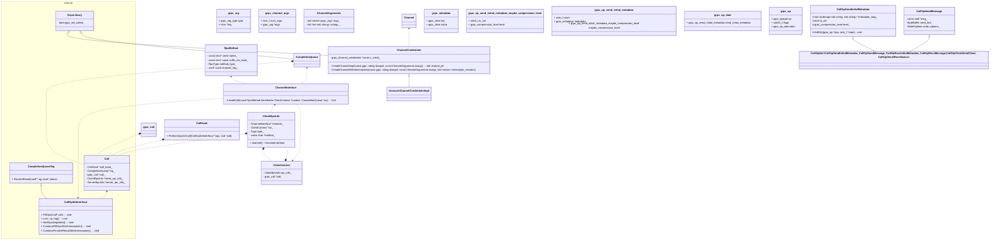

```mermaid
classDiagram
    namespace internal {
        class GrpcLibrary {
            - bool grpc_init_called_
        }
        class CompletionQueueTag {
            + FinalizeResult(void** ag, bool* status)
        }
        class Call {
            - CallHook *call_hook_
            - CompletionQueue *cq_
            - grpc_call *call_
            - ClientRpcInfo *client_rpc_info_
            - ServerRpcInfo *server_rpc_info_
        }
        class CallOpSetInterface {
            + FillOps(Call* call) : void
            + core_cq_tag() : void *
            + SetHijackingState() : void
            + ContinueFillOpsAfterInterception() : void
            + ContinueFinalizeResultAfterInterception() : void
        }
    }
    CompletionQueueTag <|-- CallOpSetInterface
    Call <.. CallOpSetInterface
    class grpc_arg {
        + grpc_arg_type type
        + char *key
    }
    class grpc_channel_args {
        + size_t num_args
        + grpc_arg *args
    }
    class grpc_call {
    }
    class RpcMethod {
        - const char* const name_
        - const char* const suffix_for_stats_
        - RpcType method_type_
        - void* const channel_tag_
    }
    class ChannelArguments {
        - std::vector~grpc_arg~ args_
        - std::list~std::string> strings_
    }
    class ChannelCredentials {
        - grpc_channel_credentials *const c_creds_
        - CreateChannelImpl(const grpc::string &target, const ChannelArguments &args) : std::shared_ptr<Channel>
        - CreateChannelWithInterceptors(const grpc::string &target, const ChannelArguments &args, std::vector<std::unique_ptr<ClientInterceptorFactoryInterface>> interceptor_creators)
    }
    GrpcLibrary <|-- ChannelCredentials
    Channel <.. ChannelCredentials
    class InsecureChannelCredentialsImpl {
    }
    ChannelCredentials <|-- InsecureChannelCredentialsImpl

    class CallHook {
        + PerformOpsOnCall(CallOpSetInterface *ops, Call *call)
    }
    class ChannelInterface {
        - CreateCall(const RpcMethod &methodm ClientContext *context, CompletionQueue *cq) : Call
    }
    class CompletionQueue {
    }
    class ClientRpcInfo {
        - ChannelInterface *channel_
        - ClientContext *ctx_
        - Type type_
        - const char *method_
        + channel() ChannelInterface
    }
    class ClientContext {
        - ClientRpcInfo rpc_info_
        - grpc_call *call_
    }
    class grpc_metadata {
        + grpc_slice key
        + grpc_slice value
    }
    class grpc_op_send_initial_metadata_maybe_compression_level {
        + uint8_t is_set
        + grpc_compression_level level
    }
    class grpc_op_send_initial_metadata {
        + size_t count
        + grpc_metadata *metadata
        + grpc_op_send_initial_metadata_maybe_compression_level maybe_compression_level
    }
    class grpc_op_data {
        + grpc_op_send_initial_metadata send_initial_metadata
    }
    class grpc_op {
        + grpc_optype op
        + uint32_t flags
        + grpc_op_data data
    }
    class CallOpSendInitialMetadata {
        # std::multimap~std::string, std::string~ *metadata_map_
        # bool is_set
        # grpc_compression_level level_
        # AddOp(grpc_op *ops, size_t *nops) void
    }
    class CallOpSendMessage {
        - const void *msg_
        - ByteBuffer send_buf_
        - WriteOptions write_options_
    }
    class CallOpSet~CallOpSendInitialMetadata, CallOpSendMessage, CallOpRecvInitialMetadata, CallOpRecvMessage,CallOpClientSendClose, CallOpClientRecvStatus~ {
    }
    GrpcLibrary <|-- CompletionQueue
    RpcMethod <.. ChannelInterface
    CompletionQueue <.. ChannelInterface
    ClientContext <.. ChannelInterface
    CallOpSetInterface <.. ChannelInterface
    ChannelInterface <.. ClientRpcInfo
    ClientContext *.. ClientRpcInfo
    ClientRpcInfo *.. ClientContext
    CallHook *.. Call
    CompletionQueue *.. Call
    grpc_call *.. Call
    ClientRpcInfo *.. Call
    CallOpSendInitialMetadata <|-- CallOpSet~CallOpSendInitialMetadata, CallOpSendMessage, CallOpRecvInitialMetadata, CallOpRecvMessage,CallOpClientSendClose, CallOpClientRecvStatus~
    CallOpSendMessage <|-- CallOpSet~CallOpSendInitialMetadata, CallOpSendMessage, CallOpRecvInitialMetadata, CallOpRecvMessage,CallOpClientSendClose, CallOpClientRecvStatus~
```

```mermaid
classDiagram
    
```
