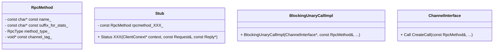

```mermaid
classDiagram
    class RpcMethod {
        - const char* const name_
        - const char* const suffix_for_stats_
        - RpcType method_type_
        - void* const channel_tag_
    }

    class Stub {
        - const RpcMethod rpcmethod_XXX_
        + Status XXX(ClientConext* context, const Request&, const Reply*)
    }

    class BlockingUnaryCallImpl {
        + BlockingUnaryCallImpl(ChannelInterface*, const RpcMethod&, ...)
    }

    class ChannelInterface {
        + Call CreateCall(const RpcMethod&, ...)
    }
```
