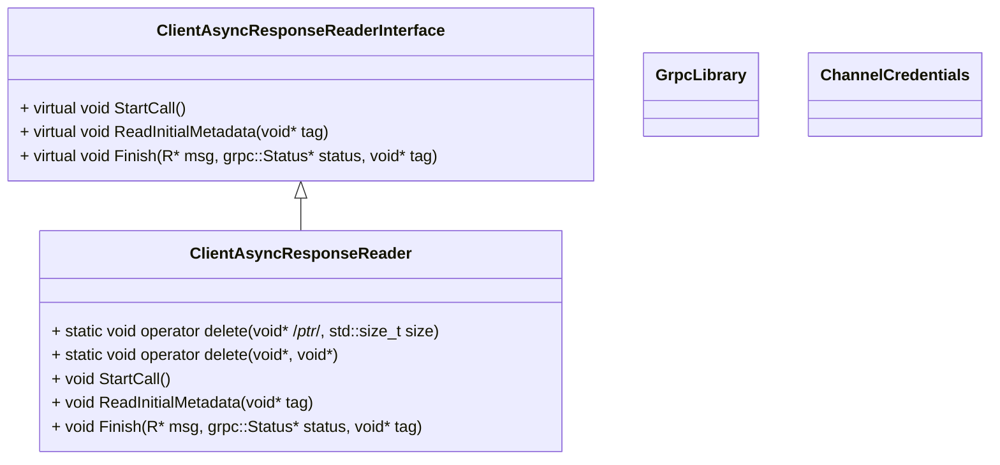

```mermaid
classDiagram
    class ClientAsyncResponseReaderInterface {
        + virtual void StartCall()
        + virtual void ReadInitialMetadata(void* tag)
        + virtual void Finish(R* msg, grpc::Status* status, void* tag)
    }
    class ClientAsyncResponseReader {
        + static void operator delete(void* /*ptr*/, std::size_t size)
        + static void operator delete(void*, void*)
        + void StartCall()
        + void ReadInitialMetadata(void* tag)
        + void Finish(R* msg, grpc::Status* status, void* tag)
    }
    ClientAsyncResponseReaderInterface <|-- ClientAsyncResponseReader
    class GrpcLibrary {
        
    }
    class ChannelCredentials {
    }
```
