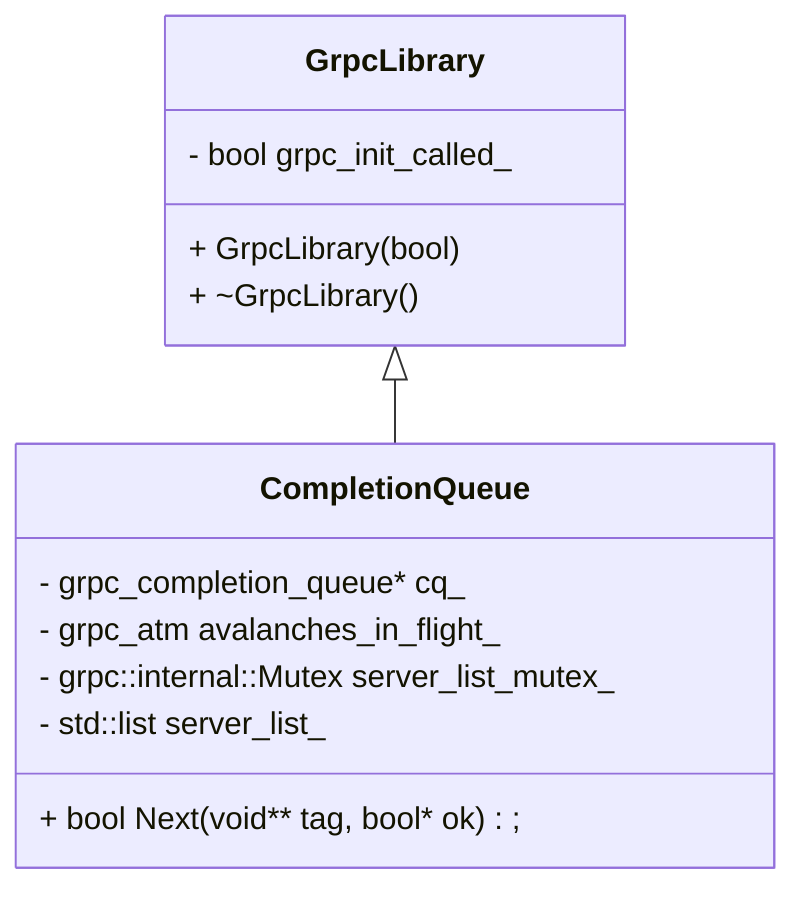

```mermaid
classDiagram
    class RpcMethod {
        - const char* const name_
        - const char* const suffix_for_stats_
        - RpcType method_type_
        - void* const channel_tag_
    }

    class Stub {
        - const RpcMethod rpcmethod_XXX_
        + Status XXX(ClientConext* context, const Request&, const Reply*)
    }

    class BlockingUnaryCallImpl {
        + BlockingUnaryCallImpl(ChannelInterface*, const RpcMethod&, ...)
    }

    class ChannelInterface {
        + Call CreateCall(const RpcMethod&, ...)
    }
```

## CompletionQueue

```mermaid
classDiagram
    class GrpcLibrary {
        - bool grpc_init_called_
        + GrpcLibrary(bool)
        + ~GrpcLibrary()
    }
    class CompletionQueue {
        - grpc_completion_queue* cq_
        - grpc_atm avalanches_in_flight_
        - grpc::internal::Mutex server_list_mutex_
        - std::list<const grpc::Server*> server_list_
        + bool Next(void** tag, bool* ok);
    }
    GrpcLibrary <|-- CompletionQueue
```
