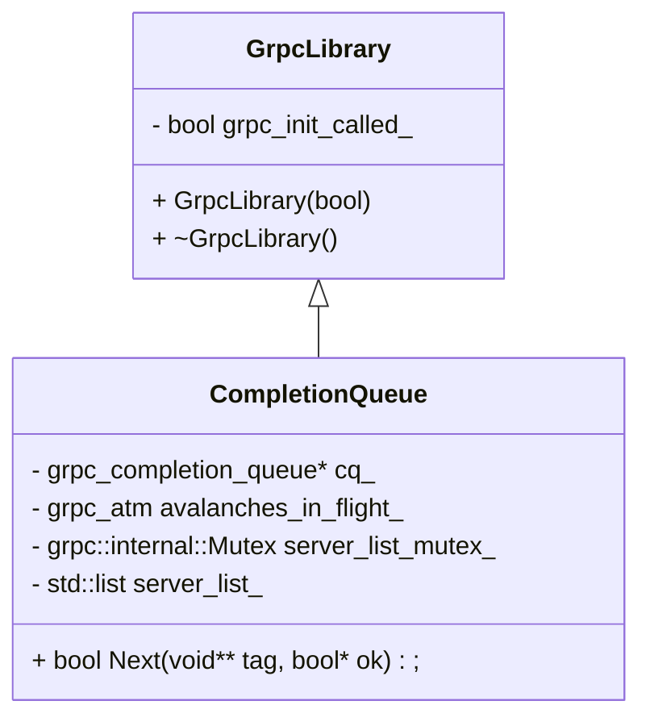

```mermaid
classDiagram
    class grpc_call {
    }
    namespace grpc {
        class GrpcLibrary {
            - bool grpc_init_called_
        }
        class RpcMethod {
            - const char* const name_
            - const char* const suffix_for_stats_
            - RpcType method_type_
            - void* const channel_tag_
        }
        class CallHook {
            + PerformOpsOnCall(CallOpSetInterface *ops, Call *call)
        }
        class Call {
            - CallHook *call_hook_
            - CompletionQueue *cq_
            - grpc_call *call_
            - ClientRpcInfo *client_rpc_info_
            - ServerRpcInfo *server_rpc_info_
        }
        class ChannelInterface {
            - CreateCall(const RpcMethod &methodm ClientContext *context, CompletionQueue *cq) : Call
        }
        class CompletionQueue {
        }
        class ClientRpcInfo {
            - ChannelInterface *channel_
            - ClientContext *ctx_
            - Type type_
            - const char *method_
            + channel() ChannelInterface
        }
        class ClientContext {
            - ClientRpcInfo rpc_info_
            - grpc_call *call_
        }
        class grpc_metadata {
            + grpc_slice key
            + grpc_slice value
        }
        class grpc_op_send_initial_metadata_maybe_compression_level {
            + uint8_t is_set
            + grpc_compression_level level
        }
        class grpc_op_send_initial_metadata {
            + size_t count
            + grpc_metadata *metadata
            + grpc_op_send_initial_metadata_maybe_compression_level maybe_compression_level
        }
        class grpc_op_data {
            + grpc_op_send_initial_metadata send_initial_metadata
        }
        class grpc_op {
            + grpc_optype op
            + uint32_t flags
            + grpc_op_data data
        }
        class CallOpSendInitialMetadata {
            # std::multimap~std::string, std::string~ *metadata_map_
            # bool is_set
            # grpc_compression_level level_
            # AddOp(grpc_op *ops, size_t *nops) void
        }
        class CallOpSendMessage {
            - const void *msg_
            - ByteBuffer send_buf_
            - WriteOptions write_options_
        }
        class CallOpSet~CallOpSendInitialMetadata, CallOpSendMessage, CallOpRecvInitialMetadata, CallOpRecvMessage,CallOpClientSendClose, CallOpClientRecvStatus~ {
        }
    }
    GrpcLibrary <|-- CompletionQueue
    RpcMethod <.. ChannelInterface
    CompletionQueue <.. ChannelInterface
    ChannelInterface <.. ClientRpcInfo
    ClientContext *.. ClientRpcInfo
    ClientRpcInfo *.. ClientContext
    CallHook *.. Call
    CompletionQueue *.. Call
    grpc_call *.. Call
    ClientRpcInfo *.. Call
    CallOpSendInitialMetadata <|-- CallOpSet~CallOpSendInitialMetadata, CallOpSendMessage, CallOpRecvInitialMetadata, CallOpRecvMessage,CallOpClientSendClose, CallOpClientRecvStatus~
    CallOpSendMessage <|-- CallOpSet~CallOpSendInitialMetadata, CallOpSendMessage, CallOpRecvInitialMetadata, CallOpRecvMessage,CallOpClientSendClose, CallOpClientRecvStatus~
```

## CompletionQueue

```mermaid
classDiagram
    class GrpcLibrary {
        - bool grpc_init_called_
        + GrpcLibrary(bool)
        + ~GrpcLibrary()
    }
    class CompletionQueue {
        - grpc_completion_queue* cq_
        - grpc_atm avalanches_in_flight_
        - grpc::internal::Mutex server_list_mutex_
        - std::list<const grpc::Server*> server_list_
        + bool Next(void** tag, bool* ok);
    }
    GrpcLibrary <|-- CompletionQueue
```
