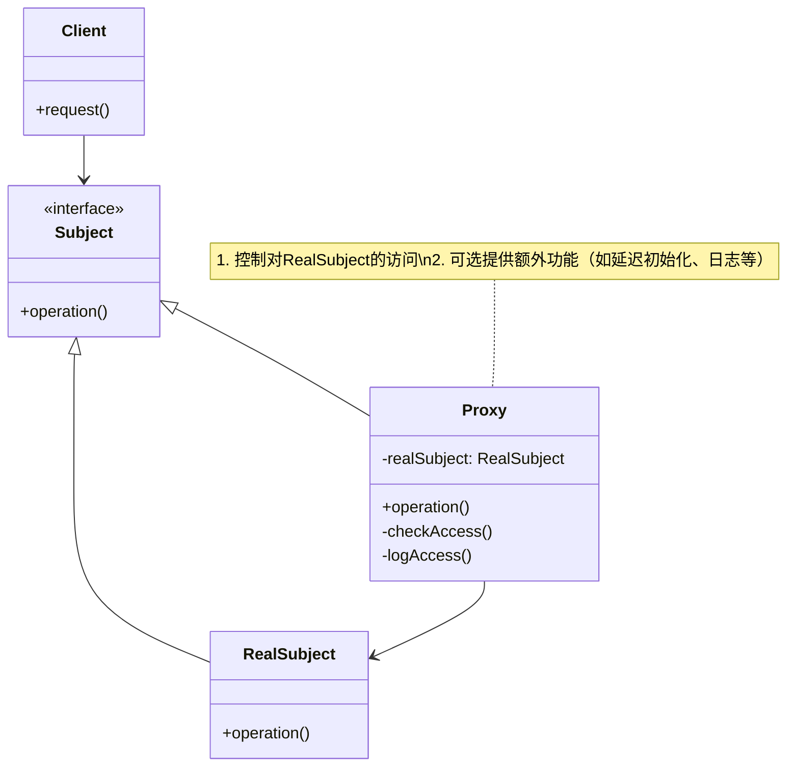

# 1. 代码模式的原理解析
在不改变原始类（或叫被代理类）代价的情况下，通过引入代理类来给原始类附加功能。

```mermaid
classDiagram
    class Client {
        +request()
    }

    class Subject {
        <<interface>>
        +operation()
    }

    class RealSubject {
        +operation()
    }

    class Proxy {
        -realSubject: RealSubject
        +operation()
        -checkAccess()
        -logAccess()
    }

    Client --> Subject
    Subject <|-- RealSubject
    Subject <|-- Proxy
    Proxy --> RealSubject

    note for Proxy "1. 控制对RealSubject的访问\n2. 可选提供额外功能（如延迟初始化、日志等）"
```
