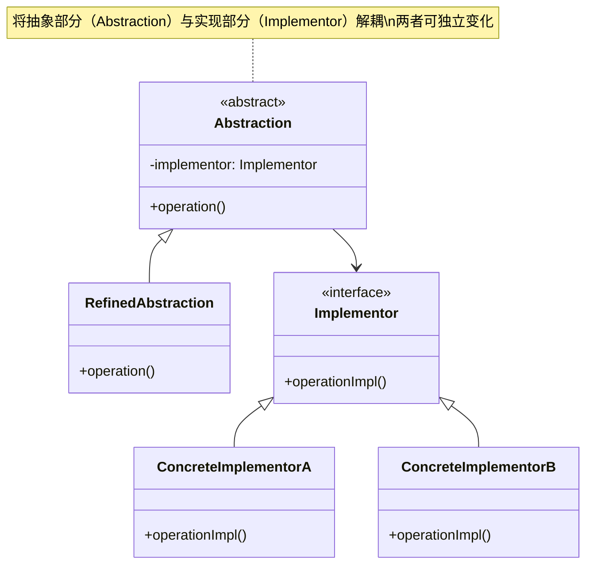

# 介绍

桥接模式，也叫做桥梁模式。在GoF的《设计模式》一书中，桥接模式是这么定义的：
    “Decouple an abstraction from its implementation so that the two can vary independently。”翻译成中文就是：“将抽象和实现解耦，让它们可以独立变化。”

# 类图

```mermaid
classDiagram
    class Abstraction {
        <<abstract>>
        -implementor: Implementor
        +operation()
    }

    class RefinedAbstraction {
        +operation()
    }

    class Implementor {
        <<interface>>
        +operationImpl()
    }

    class ConcreteImplementorA {
        +operationImpl()
    }

    class ConcreteImplementorB {
        +operationImpl()
    }

    Abstraction --> Implementor
    Abstraction <|-- RefinedAbstraction
    Implementor <|-- ConcreteImplementorA
    Implementor <|-- ConcreteImplementorB

    note for Abstraction "将抽象部分（Abstraction）与实现部分（Implementor）解耦\n两者可独立变化"
```
