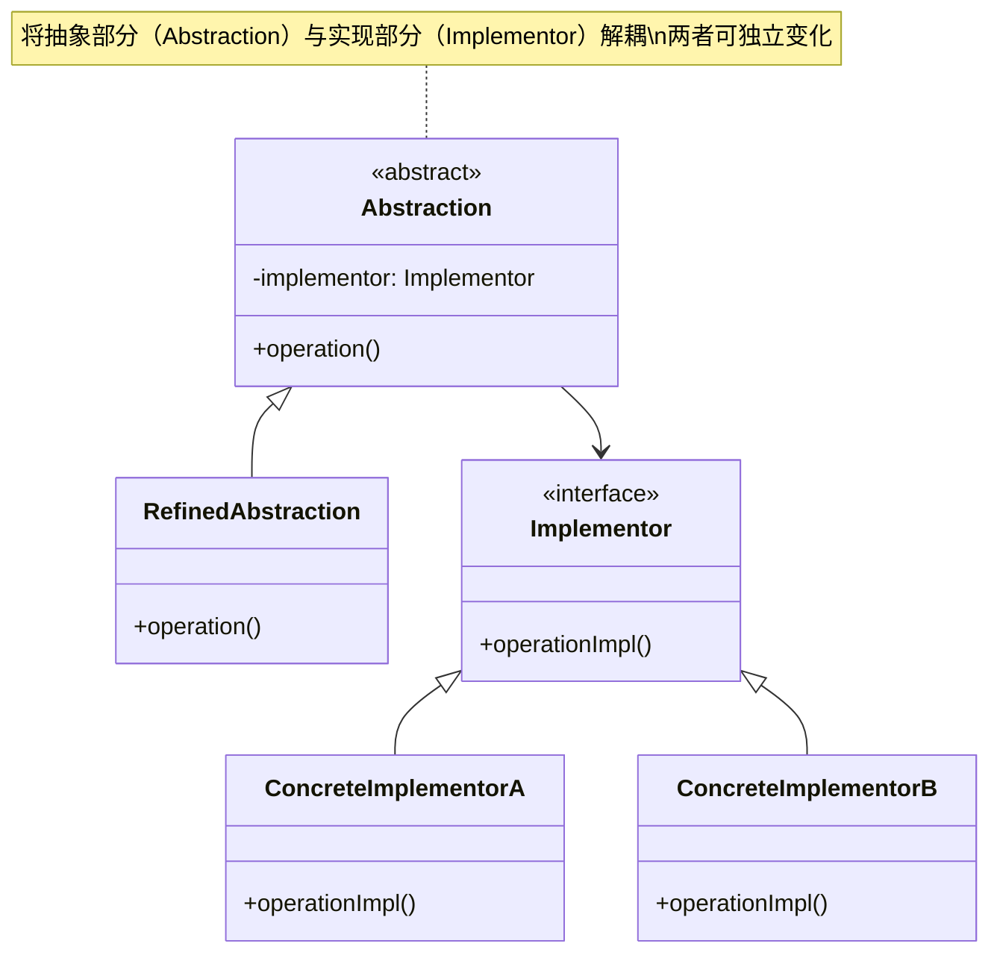

# 介绍

桥接模式，也叫做桥梁模式。在GoF的《设计模式》一书中，桥接模式是这么定义的：
    “Decouple an abstraction from its implementation so that the two can vary independently。”翻译成中文就是：“将抽象和实现解耦，让它们可以独立变化。”

# 类图

## 核心角色
+ Abstraction（抽象类）：定义高层抽象接口，并持有 Implementor 的引用；
+ RefinedAbstraction（扩展抽象类）：对抽象接口的扩展或细化；
+ Implementor（实现接口）：定义底层实现的接口；
+ ConcreteImplementorA/B（具体实现）：实现 Implementor 接口的具体类；
## 关键关系
+ 组合关系：Abstraction 通过聚合（-->）持有 Implementor；
+ 继承关系：RefinedAbstraction 继承 Abstraction（<|--），具体实现类继承 Implementor；
## 设计思想
+ 解耦抽象与实现：抽象层（如业务逻辑）和实现层（如平台/设备相关代码）可独立扩展;
+ 避免类爆炸：替代多层继承，通过组合动态切换实现;
