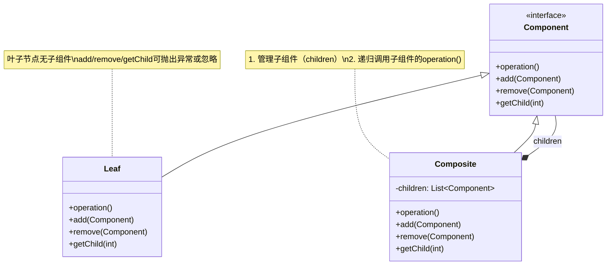

# 介绍
将一组对象组织（Compose）成树形结构，以表示一种“部分-整体”的层次结构。

# 类图

## 核心角色
+ Component（抽象组件）：定义叶子（Leaf）和容器（Composite）的公共接口，包含管理子组件的方法（如 add/remove）；
+ Leaf（叶子节点）：无子组件的原子对象，实现 operation() 但可能不支持子组件管理（可抛出异常）；
+ Composite（容器节点）：存储子组件（children），递归调用子组件的 operation()
## 关键关系
+ 继承关系：Leaf 和 Composite 均实现 Component 接口（<|--）；
+ 组合关系：Composite 通过 *-- 聚合多个 Component（可包含其他 Composite 或 Leaf）
## 设计思想
+ 统一对待叶子与容器：客户端无需区分单一对象和组合结构；
+ 递归遍历：容器节点递归调用子组件的操作（如渲染UI树、计算目录大小）；
