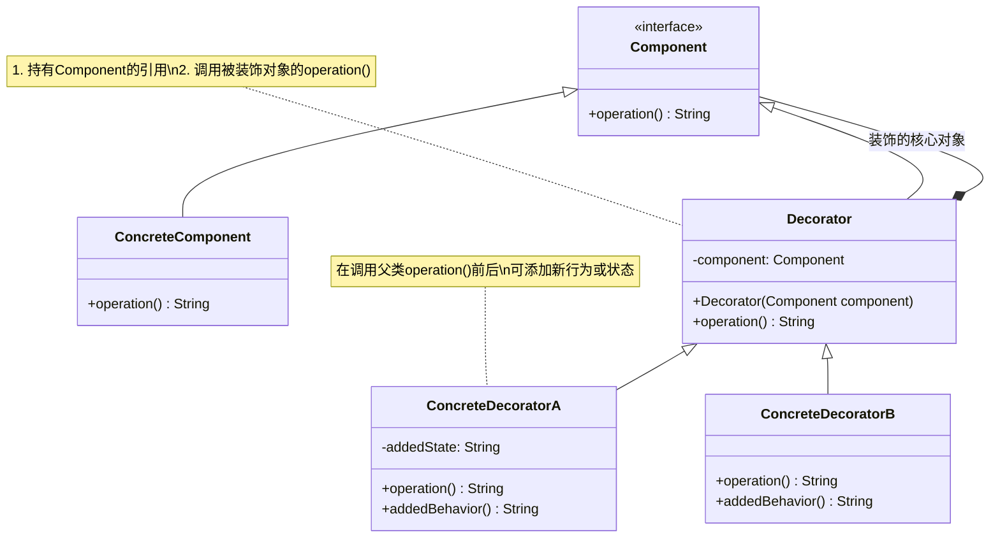

# 介绍
# 类图

## 核心角色
+ Component	抽象组件接口，定义原始对象和装饰器的公共行为（如 operation()）
+ ConcreteComponent	具体组件，实现基础功能（如“纯文本内容”）
+ Decorator	抽象装饰器，持有 Component 的引用，并实现 Component 接口
+ ConcreteDecoratorA/B	具体装饰器，添加新功能（如加密、压缩、日志等）

## 设计思想
（1）动态扩展功能
通过嵌套装饰器（如 DecoratorA(DecoratorB(ConcreteComponent))）实现功能的灵活组合；
（2）透明性
装饰器和原始组件实现同一接口，客户端无需区分原始对象和装饰后的对象；
（3）避免类爆炸
替代通过继承实现的多功能组合（如 TextWithEncryptionAndCompression 类）；

# 典型应用场景

