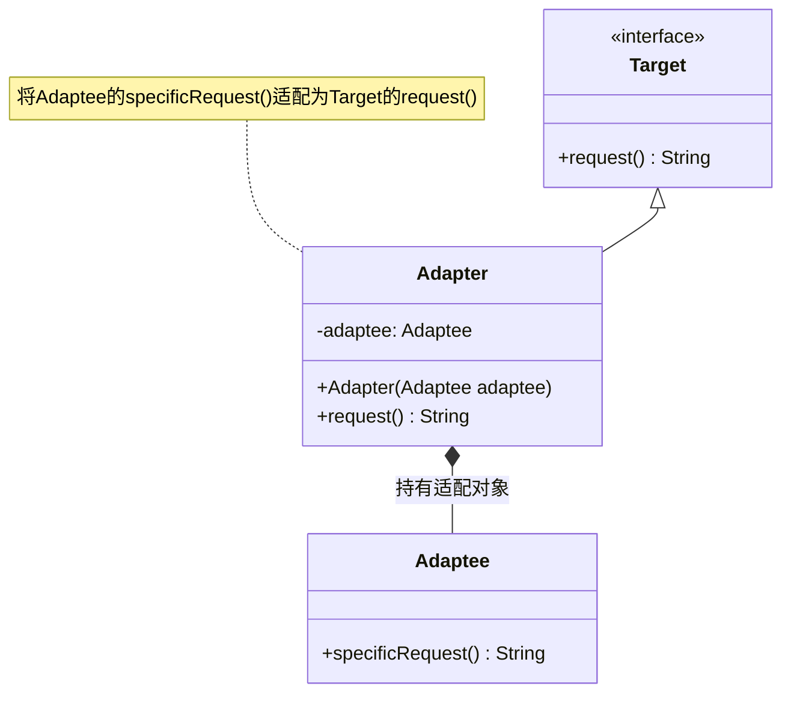
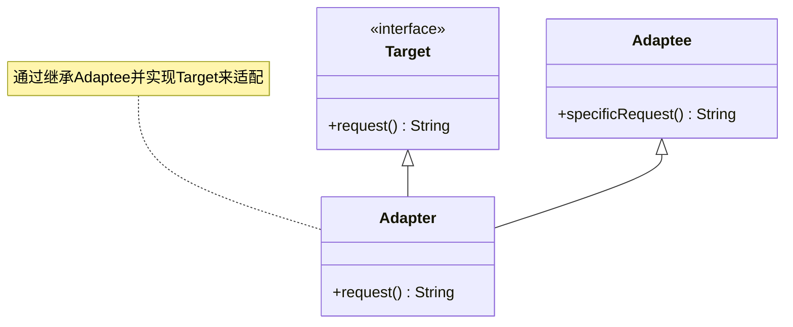

# 介绍

# 类图
## 对象适配器

```mermaid
classDiagram
    class Target {
        <<interface>>
        +request() String
    }

    class Adaptee {
        +specificRequest() String
    }

    class Adapter {
        -adaptee: Adaptee
        +Adapter(Adaptee adaptee)
        +request() String
    }

    Target <|-- Adapter
    Adapter *-- Adaptee : 持有适配对象

    note for Adapter "将Adaptee的specificRequest()适配为Target的request()"
```

## 类适配器（需多继承支持）

```mermaid
classDiagram
    class Target {
        <<interface>>
        +request() String
    }

    class Adaptee {
        +specificRequest() String
    }

    class Adapter {
        +request() String
    }

    Target <|-- Adapter
    Adaptee <|-- Adapter

    note for Adapter "通过继承Adaptee并实现Target来适配"
```
