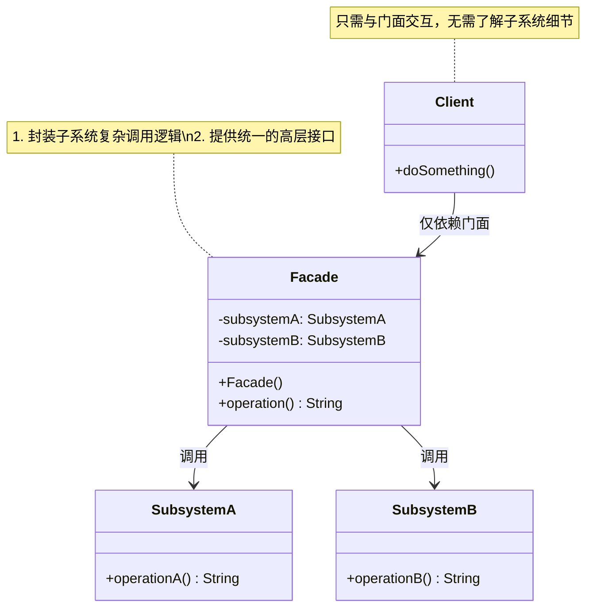

# 介绍
# 类图

## 核心角色
+ Facade	门面类，提供统一入口，组合子系统的功能调用
+ SubsystemA/B	复杂子系统类，实现具体功能（客户端不直接调用）
+ Client	客户端，仅依赖门面类，与子系统解耦

## 设计思想
（1）简化接口
将多个子系统的交互逻辑封装在门面中，客户端调用从 N次 减少到 1次
（2）降低耦合
客户端只需知道 Facade，无需了解 SubsystemA/B/C 的存在；
（3）灵活扩展
修改子系统内部逻辑时，只需调整门面类，客户端代码无需变动；
