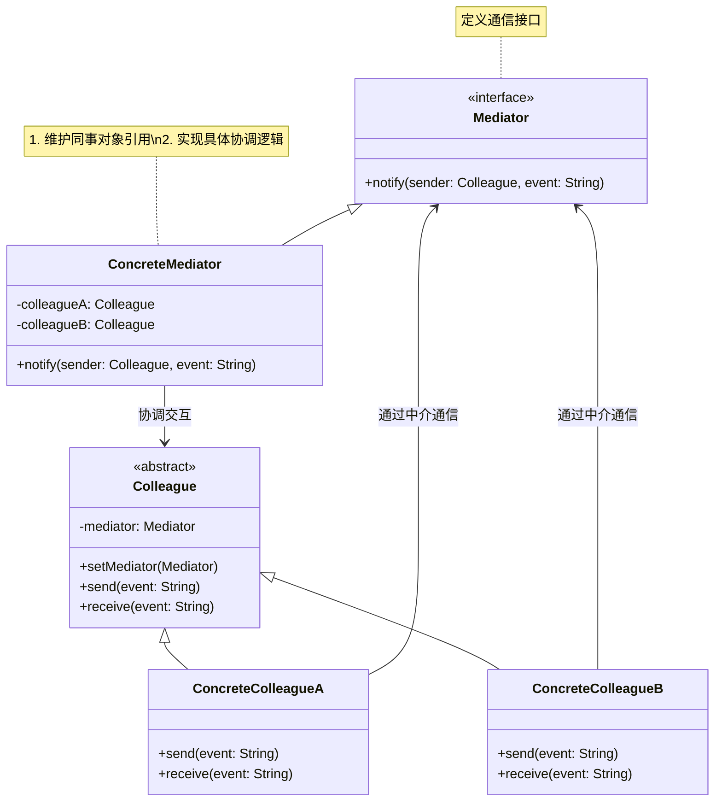

# 介绍
中介模式定义了一个单独的（中介）对象，来封装一组对象之间的交互。将这组对象之间的交互委派给与中介对象交互，来避免对象之间的直接交互。
# 类图

## 核心角色
+ Mediator	中介者接口，定义对象间通信的抽象方法（如 notify()）
+ ConcreteMediator	具体中介者，协调各同事对象的行为（如路由消息、处理依赖）
+ Colleague	同事类基类，持有中介者引用，通过中介者与其他同事通信
+ ConcreteColleague	具体同事类，实现自身业务逻辑，通过中介者触发其他同事操作

# 设计思想
（1）集中控制
将多对多交互转化为一对多（中介者作为交互中心）。
（2）解耦同事类
同事类只需知道中介者，无需相互引用。
（3）简化对象协议
交互逻辑集中在中介者中，避免分散的通信代码
