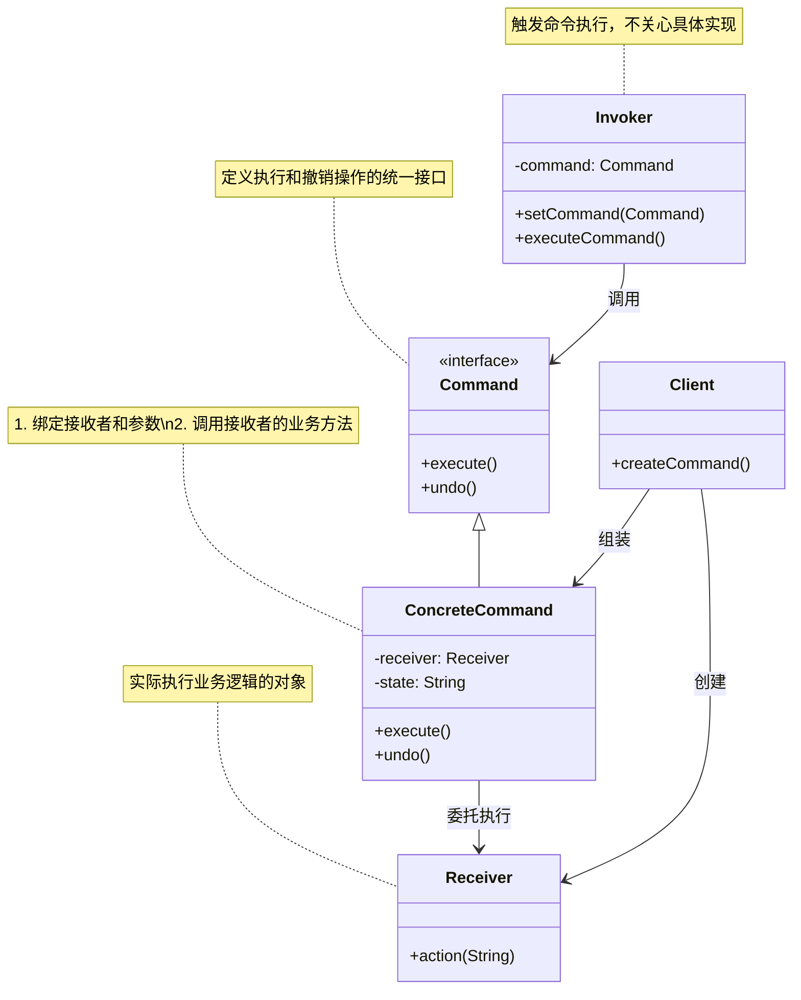

# 介绍
命令模式将请求（命令）封装为一个对象，这样可以使用不同的请求参数化其他对象（将不同请求依赖注入到其他对象），并且能够支持请求（命令）的排队执行、记录日志、撤销等（附加控制）功能。

# 类图

## 核心角色
+ Command	抽象命令接口，声明 execute() 和 undo() 方法
+ ConcreteCommand	具体命令，绑定接收者与动作参数，实现命令逻辑
+ Receiver	接收者，真正执行业务操作的对象（如灯、音响等设备）
+ Invoker	调用者，触发命令执行（如遥控器按钮）
+ Client	客户端，组装命令对象与接收者

## 设计思想
（1）解耦请求与实现
调用者（Invoker）只需知道命令接口，无需了解接收者细节。
（2）支持撤销/重做
通过 undo() 方法实现状态回滚（可结合备忘录模式存储历史状态）。
（3）灵活扩展
新增命令只需添加 ConcreteCommand 类，符合开闭原则。
