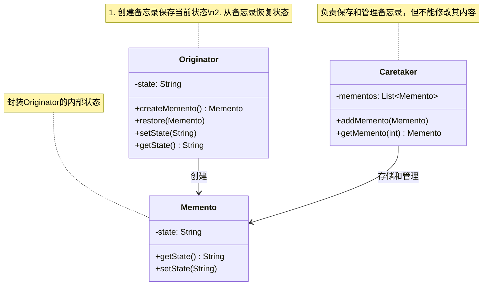

# 介绍
备忘录模式，也叫快照（Snapshot）模式，英文翻译是Memento Design Pattern。在GoF的《设计模式》一书中，备忘录模式是这么定义的：

Captures and externalizes an object’s internal state so that it can be restored later, all without violating encapsulation.

翻译成中文就是：在不违背封装原则的前提下，捕获一个对象的内部状态，并在该对象之外保存这个状态，以便之后恢复对象为先前的状态。

# 类图

## 核心角色
+ Originator	原发器，创建备忘录保存当前状态，也可从备忘录恢复状态
+ Memento	备忘录，封装原发器的内部状态（通常为不可变对象）
+ Caretaker	管理者，存储和管理备忘录，但不能直接操作其内容

## 设计思想
（1）状态封装
备忘录将对象状态存储在外部，避免直接暴露原发器内部细节。
（2）时间回溯
通过保存的快照（备忘录）实现“撤销/重做”功能。
（3）职责分离
原发器负责状态生成与恢复，管理者负责存储历史状态。
