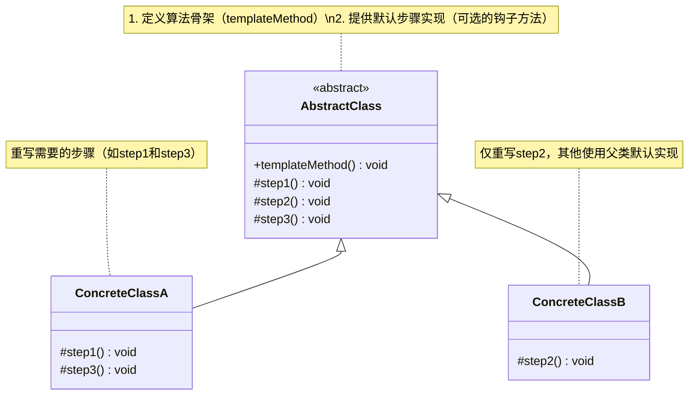

# 介绍
模板方法模式在一个方法中定义一个算法骨架，并将某些步骤推迟到子类中实现。模板方法模式可以让子类在不改变算法整体结构的情况下，重新定义算法中的某些步骤。
# 类图

## 核心角色
+ AbstractClass	抽象类，定义模板方法（算法骨架）和抽象/具体步骤方法；
+ ConcreteClass	具体子类，实现某些特定步骤（可覆盖父类默认实现）；

## 设计思想
1. 好莱坞原则
  "Don't call us, we'll call you." —— 父类控制流程，子类只需实现具体步骤。
3. 复用与扩展
+ 复用：算法骨架在抽象类中只实现一次。
+ 扩展：子类通过重写特定步骤改变局部行为。
5. 控制反转
+ 子类不能改变算法结构（如 templateMethod() 通常为 final 方法）；
