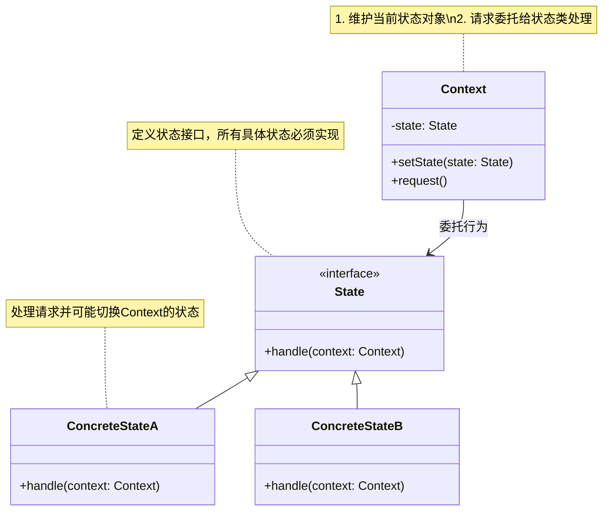

# 介绍
有限状态机，英文翻译是Finite State Machine，缩写为FSM，简称为状态机。状态机有3个组成部分：状态（State）、事件（Event）、动作（Action）。
其中，事件也称为转移条件（Transition Condition）。事件触发状态的转移及动作的执行。不过，动作不是必须的，也可能只转移状态，不执行任何动作。
# 类图

## 核心角色
+ Context	上下文类，持有当前状态对象，将行为委托给状态类；
+ State	状态接口，定义所有状态必须实现的方法（如 handle()）；
+ ConcreteState	具体状态类，实现状态对应的行为，并可触发状态切换；

## 设计思想
（1）状态驱动行为
对象的行为随内部状态改变而改变（如交通灯颜色决定通行/停止逻辑）。
（2）消除条件分支
替代大量的 if-else 或 switch-case 状态判断代码。
（3）开闭原则
新增状态只需添加新类，无需修改现有状态类或上下文
