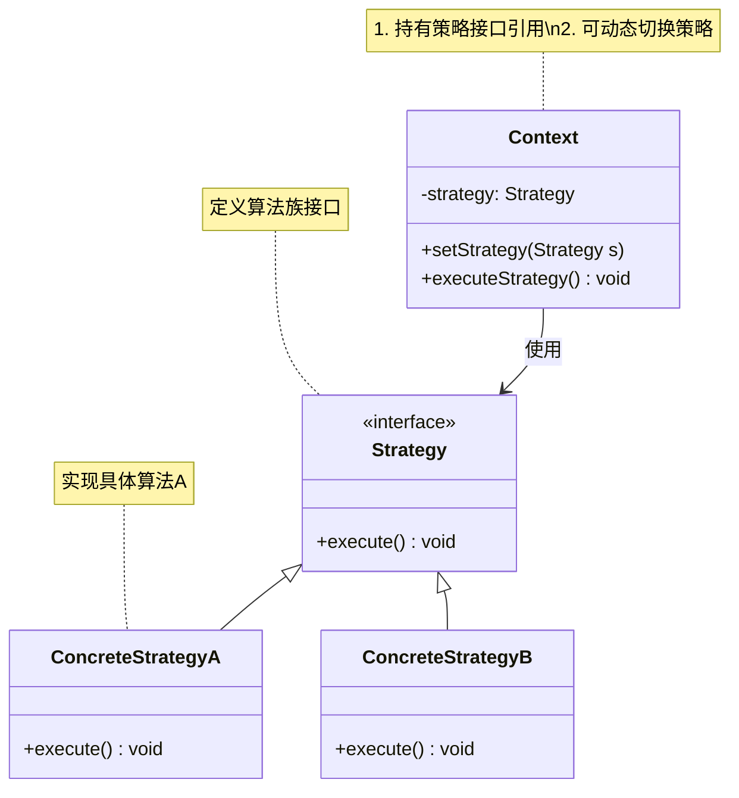

# 介绍
定义一族算法类，将每个算法分别封装起来，让它们可以互相替换。策略模式可以使算法的变化独立于使用它们的客户端（这里的客户端代指使用算法的代码）；

# 类图

## 核心角色
+ Context	上下文类，持有策略引用，通过 executeStrategy() 触发算法执行
+ Strategy	策略接口，定义算法标准（如 execute()）
+ ConcreteStrategy	具体策略类，实现不同算法变体（如快速排序、冒泡排序）

## 设计思想
（1）开闭原则
扩展开放：新增策略无需修改上下文（如新增微信支付只需加 WeChatPayment 类）。
修改封闭：ShoppingCart 代码不随策略增加而变化。

（2）消除条件分支
替代大量的 if-else 或 switch-case 逻辑（如支付方式选择）。
（3）运行时切换
策略可在运行时动态替换（如游戏角色切换攻击模式）
