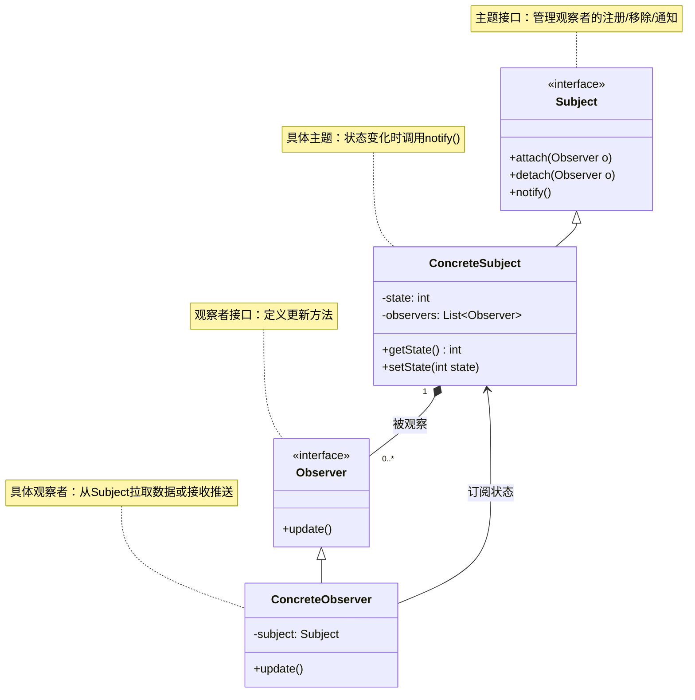

# 介绍
观察者模式也被称为发布订阅模式。在GOF的《设计模式》定义：在对象之间定义一个或多个的依赖，当一个对象状态改变的时候。所有依赖的对象都会自动收到通知。
被依赖的对象叫做**被观察者**，依赖的对象叫作观察者。
观察者模式将观察者和被观察者代码解耦； 

# 类图

## 核心角色
+ Subject	抽象主题，定义添加/删除观察者的方法，及通知方法 notify()；
+ ConcreteSubject	具体主题，维护状态（state），状态变化时触发通知；
+ Observer	抽象观察者，定义 update() 方法
+ ConcreteObserver	具体观察者，实现 update() 以响应主题变化（可主动拉取或被动接收数据）；

## 两种数据传递放肆
（1）推模型
主题主动将数据推送给观察者
（2）拉模型
观察者从主题拉取数据；

# 基于不同应用场景的不同实现方式
