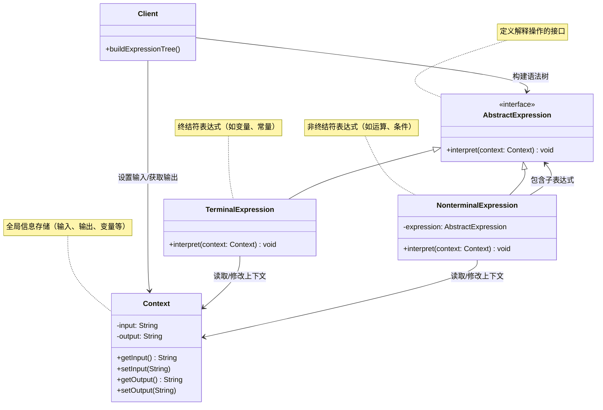

# 介绍
解释器模式为某个语言定义它的语法（或者叫文法）表示，并定义一个解释器用来处理这个语法。
# 类图

## 核心角色
+ AbstractExpression	抽象表达式，声明 interpret() 解释方法
+ TerminalExpression	终结符表达式（叶子节点），处理语言中的基本单元（如变量、常量）
+ NonterminalExpression	非终结符表达式（非叶子节点），通过子表达式组合复杂语法结构
+ Context	上下文，存储全局信息（如变量表、输入输出）
+ Client	构建语法树并触发解释执行

## 设计思想
（1）语法树结构
将语言规则表示为树形结构，叶子节点为终结符（如变量），非叶子节点为非终结符（如运算符）。
（2）递归解释
从根节点开始递归调用 interpret()，直到所有叶子节点处理完毕。
（3）上下文隔离
通过 Context 对象共享全局状态，避免表达式类之间的直接耦合。
