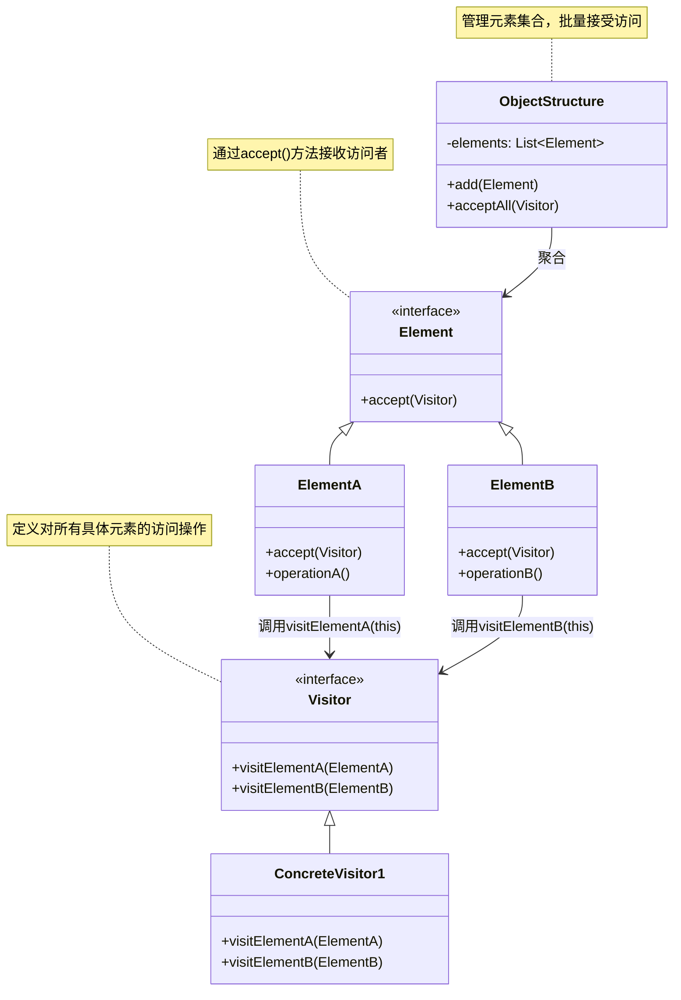

# 介绍
# 类图

## 核心角色
+ Visitor	访问者接口，为每个具体元素类声明 visit 方法（如 visitElementA()）
+ ConcreteVisitor	具体访问者，实现每个 visit 方法（如数据导出、统计等操作）
+ Element	元素接口，定义 accept(Visitor) 方法
+ ConcreteElement	具体元素，在 accept() 中调用访问者的对应方法
+ ObjectStructure	对象结构，维护元素集合，提供批量访问入口

## 设计思想
（1）双重分发（Double Dispatch）
通过 element.accept(visitor) 和 visitor.visit(element) 两次动态绑定，确定具体操作。
（2）开闭原则
+ 扩展开放：新增访问者无需修改元素类。
+ 修改封闭：元素结构稳定后无需变动。
（3）分离关注点
算法（访问者）与数据结构（元素）解耦
