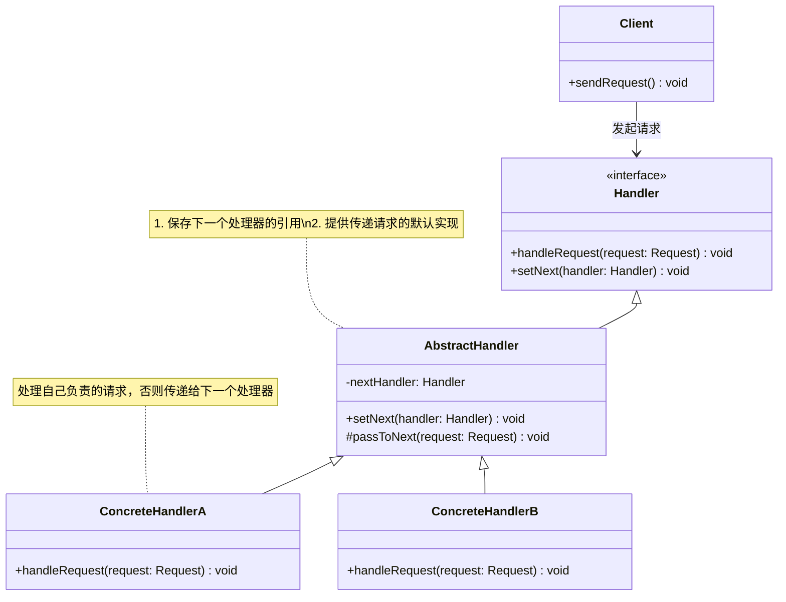

# 介绍
将请求的发送和接收解耦，让多个接收对象都有机会处理这个请求。将这些接收对象串成一条链，并沿着这条链传递这个请求，直到链上的某个接收对象能够处理它为止；

在职责链模式中，多个处理器（也就是刚刚定义中说的“接收对象”）依次处理同一个请求。一个请求先经过A处理器处理，然后再把请求传递给B处理器，
B处理器处理完后再传递给C处理器，以此类推，形成一个链条。链条上的每个处理器各自承担各自的处理职责，所以叫作职责链模式。
# 类图

## 核心角色
+ Handler	处理器接口，定义 handleRequest() 和 setNext() 方法
+ AbstractHandler	抽象处理器，实现链式传递逻辑（可选）
+ ConcreteHandler	具体处理器，处理自己能处理的请求，否则传递给下一个
+ Client	客户端，向链上的第一个处理器发起请求

## 设计思想
（1）解耦请求与处理
客户端无需知道具体由哪个处理器处理请求。
（2）动态调整责任链
可随时增删处理器或调整顺序（如 handlerA.setNext(handlerC)）。
（3）灵活处理逻辑
处理器可选择处理请求或传递，也可部分处理后再传递。
